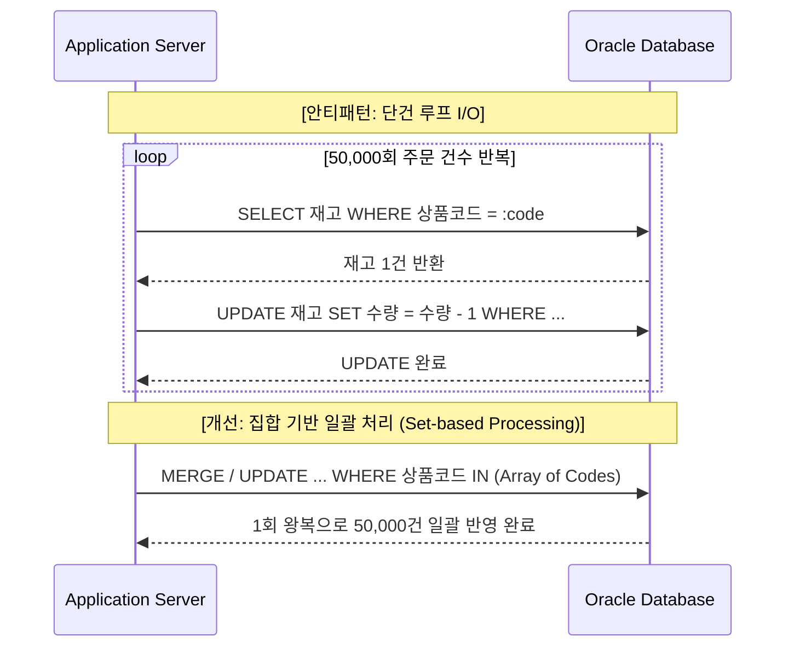
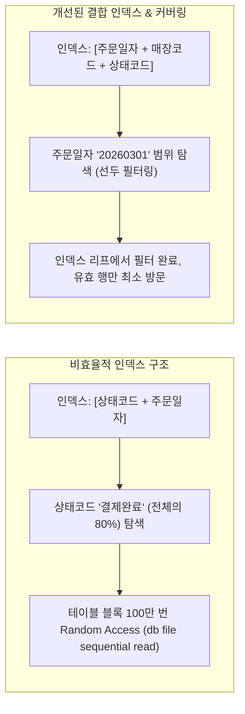

# 올영세일 회고 2편: 비효율 패턴 파악하기 (Insight)

1편에서 시간대별 AWR/ASH 데이터를 통해 시스템 리소스를 잠식하던 Top CPU SQL들을 찾아냈다면, 2편에서는 **"이 SQL들은 어째서 그토록 비효율적으로 동작했는가?"**를 심층 해부합니다.

평상시 데이터량과 트래픽에서는 문제가 수면 위로 드러나지 않다가, 올영세일과 같은 극한의 부하 환경에서 치명적인 병목으로 폭발하는 대표적인 비효율 안티패턴들을 정리했습니다.

---

## 1. 패턴 A: 단건 반복 루프(Loop I/O)와 DB Call 폭증

가장 흔하면서도 파괴적인 패턴은 **애플리케이션 계층에서 루프를 돌며 DB를 단건 호출**하는 구조입니다.



### 1.1. 세일 기간의 참사
- **평상시**: 분당 주문 수백 건 수준에서는 단건 조회/수정이 1~2ms 만에 끝나 별다른 문제가 체감되지 않음.
- **세일 피크**: 초당 수천 건의 오늘드림 주문이 쏟아지자, 네트워크 패킷 왕복(Network Round-Trip)과 오라클 내부의 Context Switching, 버퍼 캐시 래치(`cache buffers chains`) 경합으로 DB 세션 풀이 즉시 고갈됨.

### 1.2. 튜닝 처방
- 단건 `SELECT` $\rightarrow$ Java/Kotlin 단 메모리 조립 구조를 탈피하고, 오라클의 `FORALL` 일괄 바인딩 또는 단일 `MERGE INTO` 집합 처리로 전환.
- 5만 건 처리 시간: **18분 $\rightarrow$ 1.2초**로 단축.

---

## 2. 패턴 B: 인라인 뷰 필터 미인입 (View Pushdown 실패)

대규모 집계 배치 쿼리에서 흔히 발견된 패턴으로, 서브쿼리나 인라인 뷰 내부에서 전체 데이터를 불필요하게 먼저 다 읽어놓고 바깥에서 필터링하는 문제입니다.

```sql
-- [비효율 원본 쿼리]
SELECT a.order_id, b.coupon_amt
FROM orders a,
     (
       -- [문제] 세일 기간 전체 할인 이력을 먼저 수천만 건 집계
       SELECT order_id, SUM(discount_amt) AS coupon_amt
       FROM order_discounts
       GROUP BY order_id
     ) b
WHERE a.order_id = b.order_id
  AND a.order_date = '20260301'
  AND a.store_id = 'S001'; -- 특정 매장 주문만 필요함에도 불구하고!
```

### 2.1. 원인 분석
- 옵티마이저가 인라인 뷰를 메인 쿼리와 합치지 못하고(Complex View Merging 실패), `store_id`와 `order_date` 조건이 뷰 내부로 침투하지 못함(View Predicate Pushdown 누락).
- 결과적으로 `order_discounts` 테이블 수천만 건을 전부 Full Table Scan하여 해시 테이블을 만든 후 나중에 버리는 극심한 PGA/CPU 낭비 초래.

### 2.2. 튜닝 처방
- `/*+ PUSH_PRED(b) */` 힌트를 부여하거나, 쿼리 자체를 조인 형태로 리팩토링하여 필터링 조건이 선행 테이블에서 인라인 뷰로 즉시 전달되도록 구조 변경.

---

## 3. 패턴 C: 비효율적 인덱스 스캔과 대량 Table Random Access

선택도가 낮은 조건에 부적절하게 인덱스가 걸려 있거나, 인덱스 컬럼 순서가 어긋나 테이블 방문 횟수가 폭증하는 현상입니다.



- **핵심 지표**: `buffer_gets` 대비 `rows_processed` 비율.
  - 10건의 결과를 가져오기 위해 1,000,000개의 버퍼 블록을 읽었다면 전형적인 Random Access 비효율.
- **해결책**:
  - 카디널리티가 높은(변별력이 좋은) 컬럼을 인덱스 선두에 배치.
  - 자주 함께 조회되는 컬럼을 인덱스 후행에 포함시켜 **Covering Index**로 구성, 테이블 방문(Table Access by Index RowID) 자체를 0으로 제거.

---

## 4. 패턴 D: 핫 레코드(Hot Record) 집중 락 경합

올영세일 특유의 타임특가 행사 상품에서 발생한 동시성 제어 병목입니다.

- **증상**: 대기 이벤트 `enq: TX - row lock contention` 및 `buffer busy waits` 폭증.
- **원인**:
  - 특정 초특가 상품(예: 100원 딜) 1개 레코드에 초당 수천 개의 세션이 동시에 `UPDATE product SET stock = stock - 1 WHERE prod_id = :id`를 시도.
  - 트랜잭션이 커밋/롤백될 때까지 동일한 데이터 블록의 트랜잭션 슬롯(ITL) 및 행 락을 대기하면서 연쇄 지연 발생.

```mermaid
graph TD
    User1[Session 1 (주문)] -->|Row Lock 획득| Row[인기상품 #999 재고 행]
    User2[Session 2 (주문)] -->|Wait: enq: TX - row lock| Row
    User3[Session 3 (주문)] -->|Wait: enq: TX - row lock| Row
    User4[Session 4 (주문)] -->|Wait: enq: TX - row lock| Row
    UserN[Session ... N] -->|Wait: enq: TX - row lock| Row
```

### 4.1. 튜닝 및 아키텍처 개선
- **DB 행 락에 재고 차감을 의존하는 방식의 한계 인식**.
- **Redis 기반 분산 카운터/Lua Script로 선차감**:
  - 캐시 계층에서 원자적(Atomic)으로 재고를 먼저 차감하고, 검증된 건만 메시지 큐(Kafka)를 통해 DB에 비동기 배치 적재.
- DB에는 더 이상 초당 수천 번의 동일 레코드 락 경합이 발생하지 않도록 부하를 분리.

---

## 5. 결론: 안티패턴이 우리에게 남긴 것

비효율 패턴의 본질은 결국 다음 한 문장으로 수렴됩니다:
> **"평상시의 작은 낭비는 트래픽이라는 돋보기를 통과할 때 시스템을 태우는 불길이 된다."**

쿼리 한 줄의 `buffer_gets` 100개 차이가 평상시에는 0.001초 차이에 불과하지만, 동시 요청 10,000건 앞에서는 시스템 전체의 가용성을 결정짓는 분수령이 됩니다.
다음 3편에서는 기술적 기법을 넘어, 이러한 문제를 바라보는 두 가지 시선인 **"언어적 천재와 수학적 천재"**에 대해 이야기합니다.
