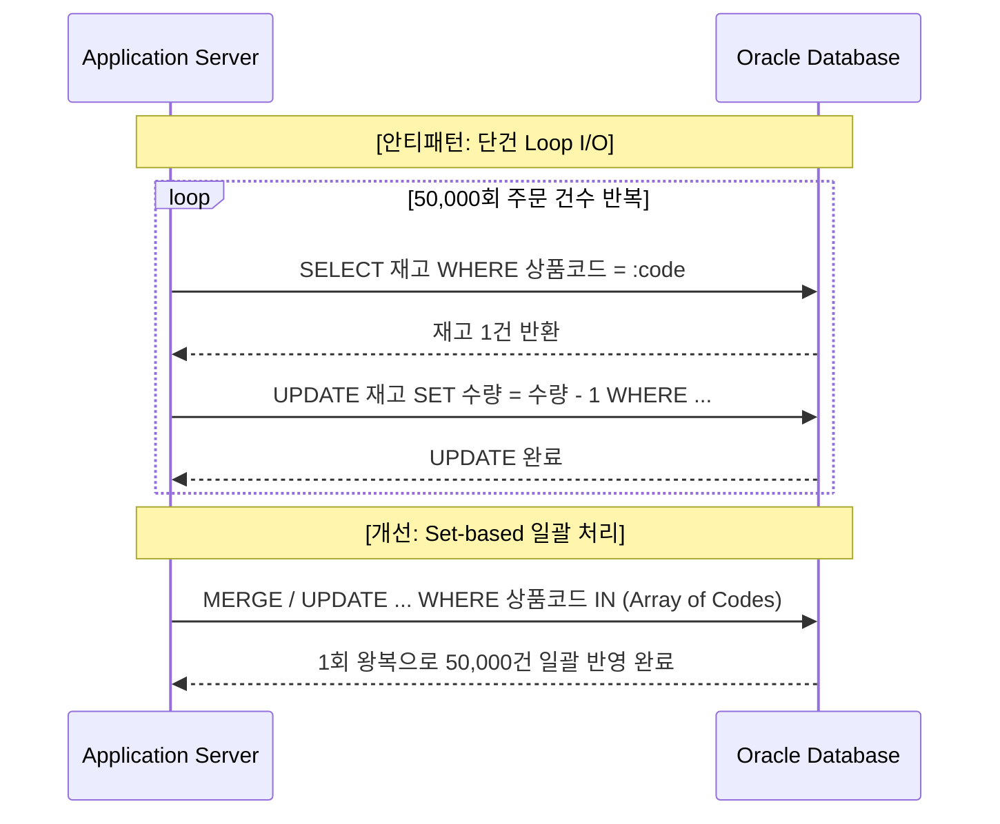
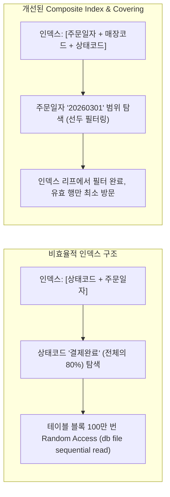

# 대규모 트래픽에서 병목을 유발한 4가지 SQL 비효율 패턴

대규모 트래픽이 몰리는 행사 기간 동안 데이터베이스 CPU 급증과 서비스 지연을 유발한 쿼리들을 전수 분석했다.

단일 건으로는 1~2ms 안에 끝나는 쿼리라도, 수만 TPS 환경에서는 작은 비효율이 증폭되어 시스템 전체의 리소스 고갈을 초래한다.

현장에서 실제로 확인하고 조치한 4가지 핵심 비효율 패턴과 개선 결과를 정리한다.

---

## 1. 패턴 A: 단건 반복 Loop I/O와 DB Call 폭증

가장 흔하게 관측된 비효율은 **애플리케이션 계층에서 루프를 돌며 DB를 단건 호출**하는 구조다.



### 1.1. 세일 피크 시간대 병목 현상
- **평상시**: 분당 주문 수백 건 수준에서는 단건 조회/수정이 1~2ms 만에 끝나 병목이 체감되지 않았다.
- **세일 피크**: 초당 수천 건의 주문이 유입되자, 네트워크 Roundtrip과 Oracle 내부의 Context Switching, Buffer Cache 래치(`cache buffers chains`) 경합으로 DB Connection Pool이 즉시 고갈되었다.

### 1.2. 튜닝 처방
- 단건 `SELECT` $\rightarrow$ 애플리케이션 메모리 조립 구조를 탈피하고, Oracle `FORALL` 일괄 바인딩 또는 단일 `MERGE INTO` 집합 처리로 전환했다.
- 5만 건 처리 시간: **18분 $\rightarrow$ 1.2초**로 단축되었다.

---

## 2. 패턴 B: 인라인 뷰 필터 미인입 (View Pushdown 실패)

대규모 집계 배치 쿼리에서 주로 발견된 패턴으로, 서브쿼리나 Inline View 내부에서 전체 데이터를 먼저 집계하고 바깥에서 필터링하는 문제다.

```sql
-- [비효율 원본 쿼리]
SELECT a.order_id, b.coupon_amt
FROM orders a,
     (
       -- [문제] 세일 기간 전체 할인 이력을 먼저 수천만 건 집계
       SELECT order_id, SUM(discount_amt) AS coupon_amt
       FROM order_discounts
       GROUP BY order_id
     ) b
WHERE a.order_id = b.order_id
  AND a.order_date = '20260301'
  AND a.store_id = 'S001'; -- 특정 매장 주문만 필요함에도 전체 집계 발생
```

### 2.1. 원인 분석
- 옵티마이저가 Complex View Merging에 실패하여 Inline View를 메인 쿼리와 병합하지 못했고, View Predicate Pushdown 누락으로 `store_id`와 `order_date` 조건이 뷰 내부로 전달되지 못했다.
- 결과적으로 `order_discounts` 테이블 수천만 건을 전부 Full Table Scan하여 해시 테이블을 생성한 후 버려지는 PGA/CPU 낭비가 발생했다.

### 2.2. 튜닝 처방
- `/*+ PUSH_PRED(b) */` 힌트를 부여하거나, 쿼리 자체를 조인 형태로 리팩토링하여 필터링 조건이 선행 테이블에서 Inline View로 직접 전달되도록 개선했다.

---

## 3. 패턴 C: 비효율적 Index Scan과 대량 Table Random Access

선택도가 낮은 조건에 부적절하게 인덱스가 적용되어 있거나, 인덱스 컬럼 순서가 맞지 않아 테이블 방문 횟수가 폭증하는 현상이다.



- **핵심 지표**: `buffer_gets` 대비 `rows_processed` 비율.
  - 10건의 결과를 가져오기 위해 1,000,000개의 버퍼 블록을 읽었다면 전형적인 Random Access 비효율이다.
- **해결책**:
  - 카디널리티가 높은 컬럼을 인덱스 선두에 배치했다.
  - 자주 함께 조회되는 컬럼을 인덱스 후행에 포함시켜 **Covering Index**로 구성, Table Access by Index RowID를 완전히 제거했다.

---

## 4. 패턴 D: Hot Record 집중 Lock 경합

세일 특유의 타임특가 행사 상품에서 발생한 동시성 제어 병목이다.

- **증상**: 대기 이벤트 `enq: TX - row lock contention` 및 `buffer busy waits` 폭증.
- **원인**:
  - 특정 초특가 상품 1개 레코드에 초당 수천 개의 세션이 동시에 `UPDATE product SET stock = stock - 1 WHERE prod_id = :id`를 시도했다.
  - 트랜잭션이 Commit 또는 Rollback될 때까지 동일한 데이터 블록의 트랜잭션 슬롯(ITL) 및 Row Lock을 대기하면서 연쇄 지연이 발생했다.

```mermaid
graph TD
    User1[Session 1 (주문)] -->|Row Lock 획득| Row[인기상품 #999 재고 행]
    User2[Session 2 (주문)] -->|Wait: enq: TX - row lock| Row
    User3[Session 3 (주문)] -->|Wait: enq: TX - row lock| Row
    User4[Session 4 (주문)] -->|Wait: enq: TX - row lock| Row
    UserN[Session ... N] -->|Wait: enq: TX - row lock| Row
```

### 4.1. 튜닝 및 아키텍처 개선
- DB Row Lock에 재고 차감을 전적으로 의존하는 방식의 한계를 인지했다.
- **Redis 기반 분산 카운터/Lua Script로 선차감**:
  - 캐시 계층에서 원자적(Atomic)으로 재고를 먼저 차감하고, 검증된 건만 메시지 큐(Kafka)를 통해 DB에 비동기 배치 적재했다.
- DB에는 더 이상 동일 레코드에 대한 초당 수천 번의 Lock 경합이 발생하지 않도록 트래픽을 분리했다.

---

## 5. 결론 및 회고

평상시에는 사소해 보이는 쿼리 한 줄의 `buffer_gets` 비효율이나 수 밀리초의 지연이라도, 동시 요청이 만 단위로 치솟는 트래픽 환경에서는 Connection Pool 고갈과 메모리 래치 경합으로 번져 전체 시스템의 가용성을 위협한다.

다음 3편에서는 이러한 성능 문제를 해결하는 접근법인 **언어적 관점과 수학적 관점의 차이**를 정리한다.
