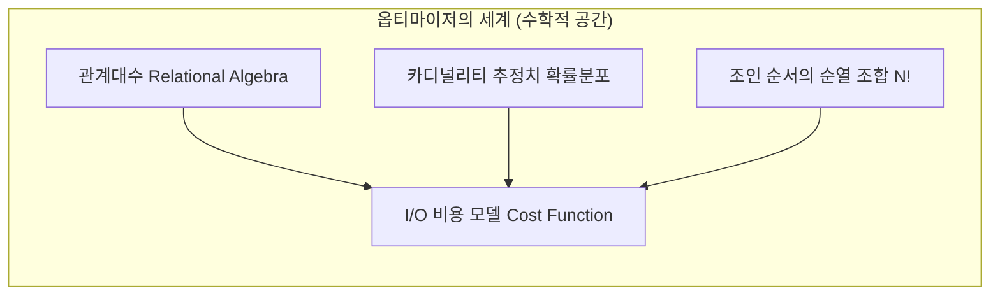
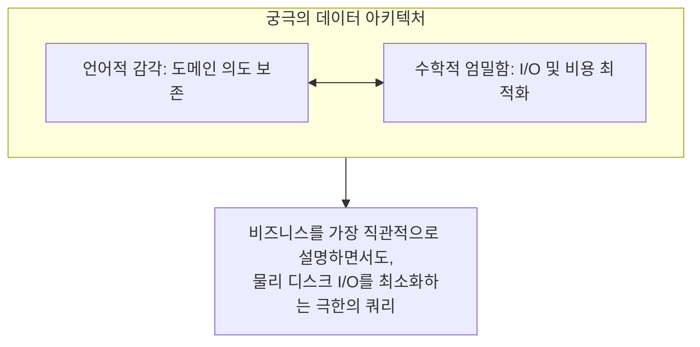

# 올영세일 회고 3편: 언어적 천재와 수학적 천재

> "SQL은 프로그래밍 언어인가, 아니면 수학적 집합의 기술인가?"

올영세일이 남긴 방대한 실행 계획과 AWR 리포트들을 정리하면서, 문득 머릿속을 맴돌던 화두가 있었습니다. 
우리가 매일 마주하는 수많은 쿼리와 튜닝의 세계에는 두 종류의 비범한 재능이 공존하고 있으며, 이 둘의 긴장과 결합이 시스템의 운명을 결정한다는 사실이었습니다.

바로 **'언어적 천재'**와 **'수학적 천재'**의 이야기입니다.

---

## 1. 언어적 천재 (The Linguistic Genius)

SQL은 본래 인간의 언어(자연어)에 가깝게 비즈니스의 의도를 선언할 수 있도록 설계된 **선언적 언어(Declarative Language)**입니다.

```sql
SELECT 고객명, SUM(주문금액)
FROM 주문
WHERE 주문일자 = '오늘' AND 배송상태 = '오늘드림'
GROUP BY 고객명
HAVING SUM(주문금액) >= 100000;
```

**언어적 천재**들은 이 SQL을 도메인의 서사(Storytelling)로 풀어내는 데 탁월합니다.
- 복잡다단한 가맹점 정산 규정, 타임딜 쿠폰 중복 할인 예외 규칙, 오늘드림 매장 배송 분기 조건을 읽는 사람으로 하여금 한 편의 글처럼 매끄럽게 읽히도록 작성합니다.
- WITH 절과 서브쿼리를 예술적으로 엮어내어, 요구사항 정의서의 문장 구조가 SQL 문장 구조와 1:1로 정확하게 일치하도록 직관을 부여합니다.

이들은 **"비즈니스 의도를 가장 명확하고 왜곡 없이 컴퓨터에게 전달하는 능력"**을 가졌습니다.

---

## 2. 수학적 천재 (The Mathematical Genius)

하지만 데이터베이스 엔진(옵티마이저)의 내부는 언어가 아니라 **철저한 수학(Mathematics)**으로 움직입니다.



**수학적 천재**들은 쿼리를 텍스트로 보지 않습니다. 그들은 쿼리를 다음과 같은 기계적 수식으로 해체합니다:
- `Cost = I/O Cost + CPU Cost`
- `Selectivity = 1 / NDV` (Number of Distinct Values)
- `Access Path = (Single Block I/O * CF) + Multi Block I/O`

그들은 글의 유려함에는 관심이 없습니다. 
- "선두 컬럼의 카디널리티가 전체의 0.03%이므로 B-Tree 리프 탐색 깊이는 3이어야 한다."
- "이 조인 순서는 $N!$ 경우의 수 중 비용 함수상 최소극점(Local Minimum)이 아니므로 해시 테이블을 반대편에 올려야 한다."
- "클러스터링 팩터가 블록 수에 수렴하므로 이 인덱스는 15% 범위까지 FTS를 압도할 수 있다."

이들은 **"물리적 한계(디스크 헤더의 이동, 메모리 버퍼 래치, CPU 사이클)를 수학적으로 계산해내는 능력"**을 가졌습니다.

---

## 3. 세일 기간에 벌어진 충돌: "아름다운 쿼리"의 비극

평상시 평화로운 환경에서는 '언어적 천재'가 작성한 쿼리가 환영받습니다. 가독성이 높고, 유지보수가 쉬우며, 비즈니스를 완벽히 대변하기 때문입니다.

하지만 **올영세일이라는 가혹한 전장**에 들어서자 참극이 벌어졌습니다.

> **"개발자님, 이 쿼리가 초당 3,000번 돌면서 CPU 100%를 치고 있습니다."**  
> **"어? 그 쿼리 로직상 전혀 문제없고 너무 직관적으로 잘 짜여진 쿼리인데요?"**

언어적으로 완벽했던 서브쿼리와 함수 호출은, 옵티마이저에게는 **"예측 불가능한 블랙박스"**였습니다.
- 비즈니스를 깔끔하게 격리하기 위해 겹겹이 두른 인라인 뷰는 View Merging을 가로막았습니다.
- 의미를 명확히 표현하고자 컬럼 좌변에 씌운 변환 함수는 옵티마이저의 히스토그램 통계를 완전히 장님으로 만들었습니다.
- 기계의 물리적 저장 구조(데이터 블록, 익스텐트)를 망각한 채 언어의 우아함만을 좇았던 코드는, 수천만 건의 데이터를 만나자마자 수억 번의 Single Block Random Access라는 재앙으로 되돌아왔습니다.

---

## 4. 진정한 고수는 두 영역의 교차점에 선다

우리가 올영세일 장애 대응과 사후 튜닝을 거치며 도달한 결론은, **둘 중 어느 하나만의 승리는 없다**는 것이었습니다.



- **수학만 아는 엔지니어**는 힌트로 도배된, 오직 그 버전의 오라클 엔진에서만 돌아가는 난해한 암호문을 만들어 동료들을 괴롭힙니다.
- **언어만 아는 엔지니어**는 화면은 예쁘게 띄우지만 대규모 트래픽이 밀려오는 순간 회사의 서버를 다운시킵니다.

진정한 튜너이자 아키텍트는:
1. **언어적 직관**으로 고객과 비즈니스의 복잡한 요구사항을 오차 없이 집합의 형태로 해석하고,
2. **수학적 엄밀함**으로 옵티마이저가 그 집합을 어떻게 블록 단위로 쪼개어 연산할지를 물리 레벨에서 계산해내며,
3. 마침내 **"사람이 읽기에도 명료하고, 기계가 실행하기에도 가장 가벼운"** 한 줄의 SQL로 귀결시킵니다.

---

## 5. 에필로그

세일이 끝나고 트래픽 그래프가 고요한 평상시로 내려앉은 모니터링 화면을 보며 생각했습니다.

우리가 며칠 밤을 새우며 AWR의 델타 수치를 쪼개고, 인라인 뷰를 풀고, 인덱스 컬럼의 순서를 뒤바꾼 작업은 단순한 야근이 아니었습니다.  
**인간의 언어로 쓰인 비즈니스를, 기계의 수학적 법칙 위에 가장 아름답고 안전하게 안착시키는 숭고한 조율의 과정**이었습니다.

올영세일은 우리에게 시스템의 한계를 가르쳐주었고, 동시에 엔지니어로서 우리가 추구해야 할 생각의 지평을 한 단계 넓혀주었습니다.
