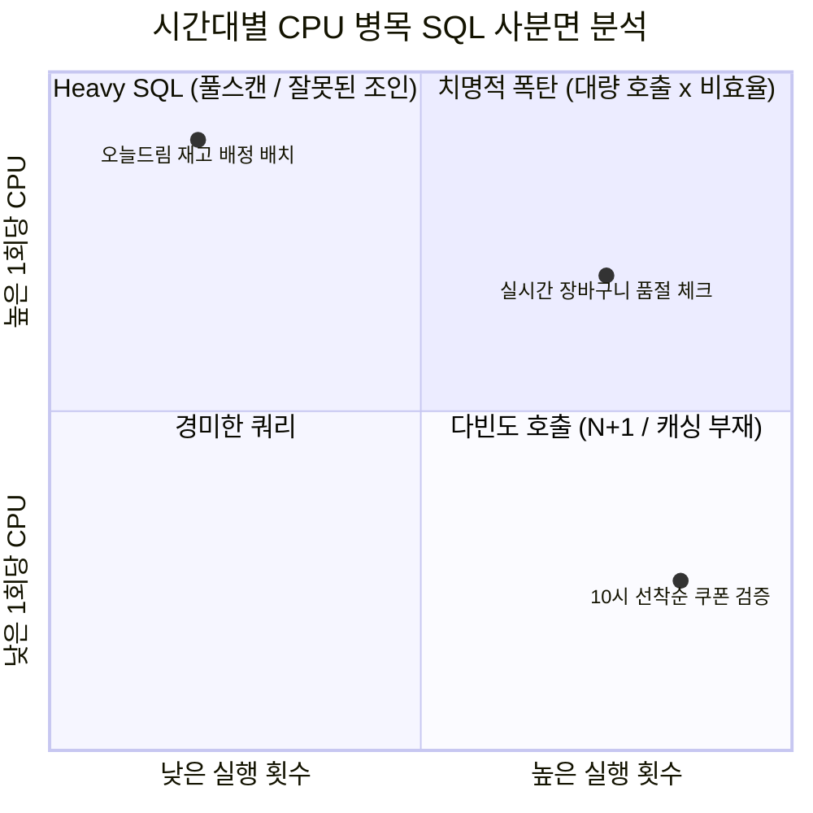

# 올영세일 회고 1편: 시간대별 CPU 높은 SQL 찾기 (Stat)

올영세일과 같은 초대형 정기 할인 프로모션 기간에는 평시대비 수배~수십 배에 달하는 트래픽과 배치 트랜잭션이 한꺼번에 몰아칩니다. 
이러한 피크 상황에서 데이터베이스 서버의 CPU 사용률이 90%를 상회할 때, **"도대체 어떤 SQL이 지금 이 순간 CPU를 집어삼키고 있는가?"**를 시간대별로 정밀하게 분리해내는 것이 성능 분석의 출발점입니다.

이 글에서는 AWR(`DBA_HIST_SQLSTAT`)과 ASH(`DBA_HIST_ACTIVE_SESS_HISTORY`)를 활용하여 올영세일 기간 동안 시간대별 CPU 소모 Top SQL을 추적하고 분석한 실무 방법론을 정리합니다.

---

## 1. 전일 평균 vs 시간대별 분석의 함정

단순히 전체 기간(예: 세일 기간 7일 전체)의 AWR 리포트 요약(Top 10 SQL by CPU Time)만 확인하는 것은 위험합니다.

```mermaid
timeline
    title 올영세일 피크 트래픽 타임라인
    00:00 : 자정 타임딜 & 일마감 정산 배치 급증
    10:00 : 선착순 1만원 쿠폰 오픈 (초당 수만 TPS 동시 인입)
    14:00 : 오후 깜짝 타임세일 이벤트
    20:00 : 퇴근길 오늘드림 주문 폭주
```

- **누적 통계의 착시**: 평상시에도 1초에 수천 번씩 수행되는 가벼운 조회 SQL들이 누적 합산되어 상위권을 독점할 수 있습니다.
- **순간 피크 유발 SQL의 은폐**: 특정 이벤트 시점(예: 10시 선착순 쿠폰 인입) 5분 동안 CPU를 100%로 치솟게 만들어 서비스 장애를 유발한 "진짜 문제 SQL"은 전체 7일 통계로 보면 하위권에 묻히게 됩니다.

따라서 **1시간 또는 스냅샷 단위로 세분화하여 구간별 델타(Delta) 통계를 추출**해야 합니다.

---

## 2. AWR 기반 시간대별 CPU Top SQL 추출 쿼리

오라클의 `DBA_HIST_SQLSTAT` 뷰는 스냅샷(`snap_id`)마다 누적 통계(`cpu_time_total`, `executions_total` 등)를 기록합니다. 
이전 스냅샷과의 차이(Delta)를 구하여 시간대별로 순수한 CPU 소비량을 산출합니다.

```sql
WITH snap_window AS (
    -- 분석 대상 기간의 스냅샷 ID 및 시간 범위 지정
    SELECT 
        s.snap_id,
        s.instance_number,
        s.begin_interval_time,
        s.end_interval_time,
        TO_CHAR(s.begin_interval_time, 'YYYY-MM-DD HH24:MI') AS start_time
    FROM dba_hist_snapshot s
    WHERE s.begin_interval_time >= TO_DATE('2026-03-01 00:00:00', 'YYYY-MM-DD HH24:MI:SS')
      AND s.begin_interval_time <  TO_DATE('2026-03-02 00:00:00', 'YYYY-MM-DD HH24:MI:SS')
),
sql_delta AS (
    SELECT
        w.start_time,
        st.sql_id,
        st.plan_hash_value,
        -- 스냅샷 간 CPU Time 차이 (마이크로초 -> 초 변환)
        ROUND((st.cpu_time_delta) / 1000000, 2) AS cpu_sec,
        ROUND((st.elapsed_time_delta) / 1000000, 2) AS elapsed_sec,
        st.executions_delta AS exec_cnt,
        st.buffer_gets_delta AS buffer_gets,
        st.disk_reads_delta AS disk_reads,
        -- 1회 수행당 CPU Time (초)
        CASE WHEN st.executions_delta > 0 
             THEN ROUND((st.cpu_time_delta / st.executions_delta) / 1000000, 4)
             ELSE 0 
        END AS cpu_per_exec
    FROM dba_hist_sqlstat st
    JOIN snap_window w 
      ON st.snap_id = w.snap_id
     AND st.instance_number = w.instance_number
),
ranked_sql AS (
    SELECT 
        d.*,
        ROW_NUMBER() OVER (PARTITION BY start_time ORDER BY cpu_sec DESC) AS rnk
    FROM sql_delta d
)
SELECT 
    start_time,
    rnk,
    sql_id,
    plan_hash_value,
    cpu_sec,
    elapsed_sec,
    exec_cnt,
    cpu_per_exec,
    buffer_gets
FROM ranked_sql
WHERE rnk <= 5
ORDER BY start_time, rnk;
```

---

## 3. SQL 유형 분류: "다빈도형" vs "헤비형"

시간대별 CPU Top SQL을 추출했을 때, 우리는 즉시 두 가지 상반된 유형으로 분류하고 대응 전략을 달리 가져가야 했습니다.



### 3.1. 유형 A: 실행 횟수 폭증형 (High Executions, Low CPU per Exec)
- **대표 케이스**: 10:00 선착순 쿠폰 다운로드 시 회원 자격 검증 쿼리
- **현상**: 1회 실행 시간은 1ms 내외로 매우 가볍지만, 동시 요청이 초당 20,000회씩 쏟아지며 전체 CPU의 40%를 독점.
- **접근법**:
  - SQL 단건 튜닝으로는 한계가 있음.
  - Redis 등 인메모리 캐시 도입, 또는 애플리케이션 단의 조건 병합(Batching)으로 DB Call 자체를 차단.

### 3.2. 유형 B: 고비용 연산형 (Low Executions, High CPU per Exec)
- **대표 케이스**: 가맹 오늘드림 정산 및 매장별 배송 구역 할당 배치
- **현상**: 수행 횟수는 시간당 수십 건에 불과하지만, 1회 수행당 CPU Time이 수백 초를 초과.
- **접근법**:
  - 인덱스 부재로 인한 과도한 Buffer Gets 및 CPU Hash Join / Sort Spill 발생.
  - 실행 계획 재조정, 파티션 프루닝, 결합 인덱스 생성을 통한 전형적인 옵티마이저 튜닝 영역.

---

## 4. ASH를 이용한 초단위 미세 피크 드릴다운

AWR 스냅샷 주기(1시간) 사이의 급격한 스파이크(Spike) 현상은 **ASH(`DBA_HIST_ACTIVE_SESS_HISTORY`)**를 통해 10초~1분 단위로 드릴다운했습니다.

```sql
-- 특정 피크 시점(예: 10:00 ~ 10:15) 1분 단위 CPU 활성 세션 분포
SELECT 
    TO_CHAR(sample_time, 'YYYY-MM-DD HH24:MI') AS min_time,
    sql_id,
    COUNT(*) AS active_samples,
    ROUND(COUNT(*) * 10 / 60, 1) AS avg_active_sessions_on_cpu
FROM dba_hist_active_sess_history
WHERE sample_time BETWEEN TO_TIMESTAMP('2026-03-01 10:00:00', 'YYYY-MM-DD HH24:MI:SS')
                      AND TO_TIMESTAMP('2026-03-01 10:15:00', 'YYYY-MM-DD HH24:MI:SS')
  AND session_state = 'ON CPU'
GROUP BY TO_CHAR(sample_time, 'YYYY-MM-DD HH24:MI'), sql_id
HAVING COUNT(*) >= 10
ORDER BY min_time, active_samples DESC;
```

이를 통해 10시 정각부터 10시 04분 사이에 정확히 어떤 `sql_id`가 CPU를 100%로 포화시켰는지를 1분 단위로 명확히 적발해낼 수 있었습니다.

---

## 5. 회고 및 교훈

1. **지표의 세분화(Granularity)**: 평상시의 전일 통계는 대규모 프로모션 기간의 돌발 장애를 진단하는 데 아무런 도움이 되지 않았습니다.
2. **Delta 기반 추적의 필수성**: 누적치가 아닌 스냅샷 간 변화량(Delta)을 기준으로 정렬해야 피크를 견인한 진범 SQL을 골라낼 수 있습니다.
3. 다음 편에서는 이렇게 찾아낸 SQL들이 **어떤 구조적 비효율 패턴(안티패턴)**을 가지고 있었는지 분석해 봅니다.
