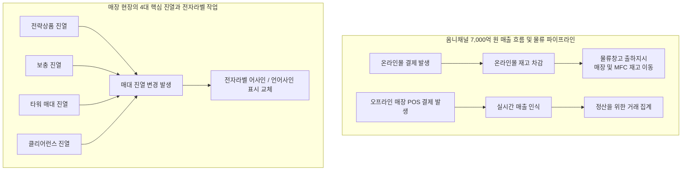
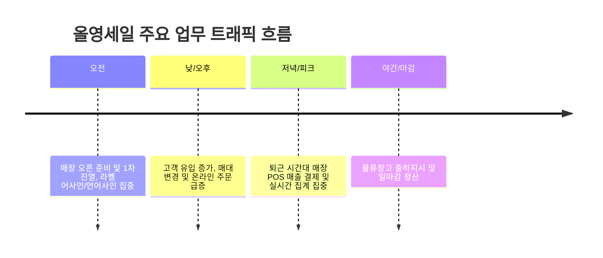
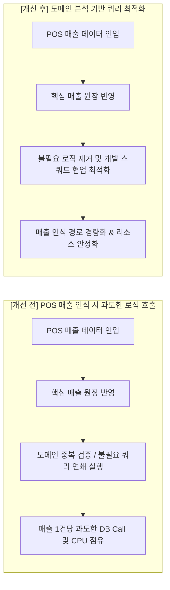
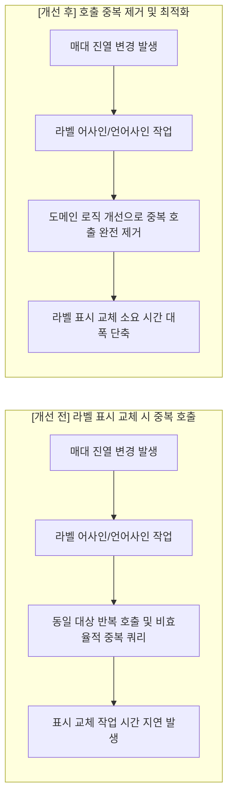
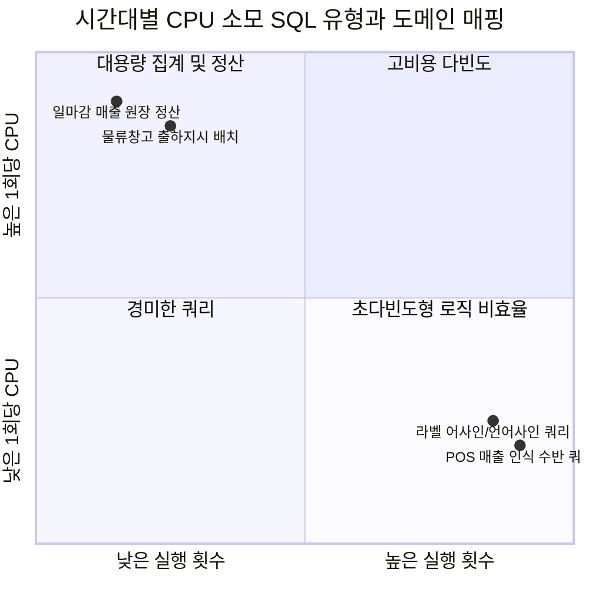

# (작성중) 시간대별 CPU 높은 SQL 포착을 통한 주요 비즈니스 로직 개선 포인트 발견 및 최적화

올영세일과 같은 대규모 행사 기간에는 오프라인 매장과 온라인몰 전반에 걸쳐 평시대비 수배에서 수십 배에 달하는 트랜잭션이 집중적으로 발생합니다.

이 시점에 데이터베이스 서버의 CPU 점유율이 높게 치솟는 상황을 마주했을 때, 단순히 기술적으로 어떤 SQL이 느린지를 찾아내는 것에서 끝나서는 안 됩니다.  
"지금 이 순간 시스템에서 수행되는 주요 비즈니스 업무와 연관이 있는지 확인하고 그 업무가 원활하게 수행되는데 방해가 되는 부분이 있다면 기술적으로 어떻게 개선해 낼 것인가?"가 핵심입니다.

이번 회고 1편에서는 시간대별 AWR 및 ASH 통계를 기반으로 시간대별 CPU 사용률이 높은 쿼리를 취합한 후, 개발 스쿼드와의 면밀한 도메인 로직 분석을 통해 개선을 이끌어낸 **두 가지 핵심 업무 최적화 사례**를 정리합니다.

---

## 1. 비즈니스 맥락: 7천억 원의 매출 흐름과 매장 현장의 핵심 업무

올영세일 기간 동안 시스템이 뒷받침해야 하는 핵심 비즈니스 중 아래 두 가지가 있습니다.



### 1.1. 총 7,000억 원 규모의 거래액을 책임지는 매출 집계
세일 기간 동안 온라인몰 출하지시와 전국 매장 POS 매출 집계가 맞물려 **총 7,000억 원 규모의 거래와 현금 흐름**이 발생합니다.
- **온라인몰**: 고객 주문 결제 시 즉시 온라인몰 재고를 차감한 후, 각 매장 혹은 MFC로 상품을 적시 보충하기 위해 중앙 물류창고에서 출하지시가 쉴 새 없이 일어납니다.
- **오프라인 매장**: 전국 1,300여 개 매장에서 발생하는 실시간 POS 결제 데이터가 매출로 확정되고 집계됩니다.

### 1.2. 오프라인 매장 현장의 4대 진열 업무와 전자라벨
오프라인 매장 직원들은 세일 기간 동안 최적의 판매 환경을 유지하기 위해 4가지 핵심 진열 업무를 빈번하게 수행합니다.
1. **전략상품 진열**: 세일 주력 프로모션 브랜드 및 기획 상품의 전면 배치
2. **보충 진열**: 실시간으로 완판되는 매대 상품의 즉각적인 재고 채움
3. **타워 매대 진열**: 매장 주요 동선 골든존에 대형 행사 매대 구성
4. **클리어런스 진열**: 한정 수량 및 특가 상품의 매대 전환

매대 진열 변경이 일어날 때마다 매장 단말기를 통해 상품과 전자가격표 태그를 연결하는 **어사인**, 혹은 기존 연결을 해제하는 **언어사인** 표시 교체 작업이 수반됩니다.  
이 표시 교체 작업이 지체 없이 처리되어야 매장 직원들이 매대 구성을 빠르게 마치고 본연의 상품 진열과 고객 응대에 집중할 수 있습니다.

---

## 2. 누적 통계의 착시와 시간대별 Delta CPU 분석

대규모 트래픽 분석 시 가장 주의해야 할 부분은 **세일 기간 전체 누적 통계에만 의존하는 것**입니다.



### 2.1. 빈번한 업무가 만드는 누적 통계의 함정
올영세일 기간에는 전국 매장에서 **라벨 어사인/언어사인 업무**와 **POS 매출 집계 업무**가 하루 종일 대량으로 빈번하게 발생합니다.  
단순 누적 통계로만 접근하면 다음과 같은 함정에 빠지기 쉽습니다:
- **"당연히 많이 도는 쿼리"라는 착각**: 원래 업무 빈도가 높은 영역이므로, 누적 실행 횟수와 CPU 소모 총량이 높은 것을 비효율이 아닌 정상적인 업무 부하로 오판하고 지나치기 쉽습니다.
- **도메인 처리 대비 지나치게 많은 쿼리 호출**: 실제 비즈니스 트랜잭션 건수 대비 쿼리 호출이 몇 배로 중복 발생하고 있는지 여부는 누적 통계만으로는 분리해 내기 어렵습니다.

따라서 1시간 스냅샷 혹은 수분 단위로 구간을 쪼개어 변화량을 산출하고, **해당 시간대의 실제 비즈니스 처리 건수(매출 인식, 매장별 진열상품 변경)와 쿼리 실행 횟수(`executions_delta`)를 대조하는 시간대별 분석**이 필수적입니다.

---

## 3. AWR & ASH 기반 시간대별 CPU Top SQL 추출 쿼리

### 3.1. AWR 스냅샷 기반 시간대별 Delta Top SQL 쿼리
`DBA_HIST_SQLSTAT`의 누적 통계치 대신 스냅샷 간 차이인 `_DELTA` 지표를 산출하여, 특정 시간대에 실제 CPU 리소스를 많이 점유한 SQL을 추출합니다.

```sql
WITH snap_window AS (
    -- 분석 대상 스냅샷 구간 및 시간 범위 지정
    SELECT 
        s.snap_id,
        s.instance_number,
        s.begin_interval_time,
        s.end_interval_time,
        TO_CHAR(s.begin_interval_time, 'YYYY-MM-DD HH24:MI') AS start_time
    FROM dba_hist_snapshot s
    WHERE s.begin_interval_time >= TO_DATE('2026-03-01 08:00:00', 'YYYY-MM-DD HH24:MI:SS')
      AND s.begin_interval_time <  TO_DATE('2026-03-01 23:00:00', 'YYYY-MM-DD HH24:MI:SS')
),
sql_delta AS (
    SELECT
        w.start_time,
        st.sql_id,
        st.plan_hash_value,
        -- 스냅샷 구간 내 순수 CPU 소비량 (초 단위 변환)
        ROUND(st.cpu_time_delta / 1000000, 2) AS cpu_sec,
        ROUND(st.elapsed_time_delta / 1000000, 2) AS elapsed_sec,
        st.executions_delta AS exec_cnt,
        st.buffer_gets_delta AS buffer_gets,
        st.disk_reads_delta AS disk_reads,
        -- 1회 수행당 CPU Time (초)
        CASE WHEN st.executions_delta > 0 
             THEN ROUND((st.cpu_time_delta / st.executions_delta) / 1000000, 4)
             ELSE 0 
        END AS cpu_per_exec
    FROM dba_hist_sqlstat st
    JOIN snap_window w 
      ON st.snap_id = w.snap_id
     AND st.instance_number = w.instance_number
),
ranked_sql AS (
    SELECT 
        d.*,
        ROW_NUMBER() OVER (PARTITION BY start_time ORDER BY cpu_sec DESC) AS rnk
    FROM sql_delta d
)
SELECT 
    start_time,
    rnk,
    sql_id,
    plan_hash_value,
    cpu_sec,
    elapsed_sec,
    exec_cnt,
    cpu_per_exec,
    buffer_gets
FROM ranked_sql
WHERE rnk <= 5
ORDER BY start_time, rnk;
```

### 3.2. ASH 기반 단기 집중 부하 추적
스냅샷 구간 내에서 특정 10~15분 동안 CPU 사용률이 급등한 경우, ASH를 통해 1분 단위 활성 세션 분포를 추적합니다.

```sql
SELECT 
    TO_CHAR(sample_time, 'YYYY-MM-DD HH24:MI') AS min_time,
    sql_id,
    COUNT(*) AS active_samples,
    ROUND(COUNT(*) * 10 / 60, 1) AS avg_active_sessions_on_cpu
FROM dba_hist_active_sess_history
WHERE sample_time BETWEEN TO_TIMESTAMP('2026-03-01 18:30:00', 'YYYY-MM-DD HH24:MI:SS')
                      AND TO_TIMESTAMP('2026-03-01 19:00:00', 'YYYY-MM-DD HH24:MI:SS')
  AND session_state = 'ON CPU'
GROUP BY TO_CHAR(sample_time, 'YYYY-MM-DD HH24:MI'), sql_id
HAVING COUNT(*) >= 10
ORDER BY min_time, active_samples DESC;
```

---

## 4. [개선 사례 1] 매장 POS 매출 인식 대비 과도한 불필요 로직 제거

시간대별 Delta 분석을 통해 첫 번째로 포착한 비효율은 **매장 POS 매출 집계 시간대에 실제 매출 인식 처리량 대비 과도하게 발생하는 쿼리**이었습니다.



### 4.1. 포착된 비효율 지표
- 오프라인 매장 매출 결제가 집중되는 피크 시간대에, 실제 확정된 **POS 매출 전표 건수에 비해 매출 집계 SQL의 실행 횟수가 비정상적으로 높게 형성**되어 상위 CPU를 점유하고 있었습니다.
- 1회당 CPU 소모 시간은 수 밀리초에 불과했으나, 대규모 세일 매출 트랜잭션과 맞물리며 초당 수천~수만 회 단위로 누적되어 CPU 리소스를 차지하고 있었습니다.

### 4.2. 도메인 중심 쿼리 분석
- 문제의 SQL들을 추적한 결과, POS에서 정상 결제 승인되어 넘어온 전표 데이터임에도 불구하고, 애플리케이션 서비스 계층에서 동일한 거래 상태와 마스터 정보를 다단계에 걸쳐 반복 확인하는 중복 로직이 포함되어 있었습니다.
- 실제 매출을 원장에 확정하고 기록하는 데 필수적이지 않은 부가 조회 로직들이 동반 실행되면서, 순수 매출 인식 건수 대비 불필요한 DB Call이 배수로 발생하고 있었습니다.

### 4.3. 개발 스쿼드 협업 및 최적화
- **도메인 로직 검토 및 중복 제거**: 담당 개발 스쿼드와 함께 매출 인식 파이프라인의 도메인 로직을 면밀히 분석했습니다. 이미 전 단계에서 정합성이 보장된 조건에 대한 반복 조회를 제거하고, 필수 원장 처리 중심의 경량 파이프라인으로 구조를 정돈했습니다.
- **불필요 쿼리 실행 차단**: 실시간 매출 집계 시점에 즉시 필요하지 않은 부가 조회 및 이력성 쿼리를 정리하여 호출 빈도를 대폭 축소했습니다.
- **개선 결과**:
  - 매출 인식 파이프라인 관련 쿼리의 CPU 사용량을 60% 이상 절감.
  - 세일 기간 동안 일어난 **7,000억 원 규모의 온라인몰 출하지시 및 매장 POS 매출 집계 업무를 쾌적한 데이터베이스 리소스 환경에서 안정적으로 뒷받침**.

---

## 5. [개선 사례 2] 매대 진열 변경 시 전자라벨 표시 로직 중복 호출 개선

두 번째로 포착한 과제는 **매대 진열 변경이 일어날 때마다 실행되는 전자라벨 표시 교체 로직의 중복 호출**이었습니다.



### 5.1. 포착된 비효율 지표
- 매장 오픈 준비 시간대와 오후 매대 재배치 시간대에 매대 관리 및 전자라벨 매핑 관련 SQL이 시간대별 Top CPU 리스트에 집중적으로 등장했습니다.
- 특히 라벨 정보를 갱신하는 쿼리의 실행 횟수가 현장에서 실제로 발생한 진열 변경 건수보다 훨씬 큰 배수로 측정되었습니다.

### 5.2. 도메인 중심 쿼리 분석
- 매장 직원들은 전략상품, 보충진열, 타워매대, 클리어런스 등 행사 진행에 맞추어 수시로 상품 위치를 이동하고 매대를 재구성합니다.
- 이때 단말기로 상품과 전자라벨을 매핑하는 **어사인** 및 기존 매핑을 푸는 **언어사인** 작업이 실행되는데, 로직 호출 흐름에 비효율이 존재했습니다:
  - 교차 라벨의 경우 중복 체크하는 로직이 있어서 하위 라벨의 수만큼 배수로 호출하는 문제를 발견했습니다.
- 이로 인해 데이터베이스에 불필요한 쿼리 부하가 가중되고, 현장에서는 라벨 어사인/언어사인 표시 교체 작업의 응답 시간이 길어지는 문제가 발생했습니다.

### 5.3. 개발 스쿼드 협업 및 최적화
- **표시 교체 로직 호출 최적화**: 개발 스쿼드와 협력하여 매대 변경 이벤트 발생 시 실제 변경 대상 상품과 라벨만 정확히 식별하여 갱신하도록 도메인 로직을 정밀화했습니다.
- **중복 호출 제거**: 동일 트랜잭션 내에서 중복으로 발생하던 라벨 상태 변경 쿼리를 제거하고 단일 처리로 통합했습니다.
- **개선 결과**:
  - 전자라벨 연동 관련 쿼리의 실행 횟수를 70% 이상 감축.
  - **라벨 어사인/언어사인 표시 교체 작업 시간을 대폭 단축**시켜, 매장 직원들이 세일 현장에서 매대 변경 업무를 한층 빠르고 원활하게 완수할 수 있도록 기여.

---

## 6. SQL 유형 분류: 다빈도형 vs 헤비형

시간대별 CPU Top SQL을 분석할 때, 비즈니스 성격과 실행 특성에 따라 다음과 같이 두 가지 유형으로 분류하여 접근 방식을 차별화했습니다.



### 6.1. 유형 A: 다빈도 호출형
- **대표 사례**: POS 매출 인식 시 수반되던 중복 검증 쿼리, 매대 변경 시 전자라벨 중복 호출 쿼리
- **특징**: 1회 실행 시간은 수 밀리초로 극히 짧아 평시에는 전혀 눈에 띄지 않지만, 대규모 프로모션 상황에서 초당 수천 회 이상 폭증하며 데이터베이스 전체 CPU의 상당 부분을 차지함.
- **해결 방안**: 인덱스 변경과 같은 단일 SQL 튜닝으로는 근본적인 한계가 존재함. **개발 스쿼드와 도메인 로직을 분석하여 불필요한 호출 자체를 제거하거나 일괄 집합 처리로 전환**해야 함.

### 6.2. 유형 B: 고비용 연산형
- **대표 사례**: 중앙 물류창고 출하지시 배정 쿼리, 야간 매출 원장 일마감 집계 쿼리
- **특징**: 실행 횟수는 시간당 수십~수백 건 수준이나, 1회 수행 시 대량의 블록을 읽고 복잡한 연산을 수행하여 CPU 점유 시간이 김.
- **해결 방안**: 결합 인덱스 구성, 파티션 프루닝, 인라인 뷰 조건 침투 등 **옵티마이저 실행 계획 최적화 중심의 데이터베이스 튜닝**으로 해결.

---

## 7. 회고: 기술적 결함 탐지를 넘어 회사 업무 성과로 견인하기까지

데이터베이스 모니터링을 진행할 때, 화면에 표시되는 CPU 사용률이나 Buffer Gets 수치에만 매몰되면 시스템 개선이 단순한 "리소스 아끼기"에 머물게 됩니다.

1. **지표를 비즈니스 업무와 대조하기**: 특정 시간대 CPU 1위 쿼리를 발견했을 때, "이 쿼리가 왜 CPU를 쓰는가?"를 넘어 **"이 쿼리가 온라인몰 출하지시, POS 매출 집계, 혹은 매장의 진열 변경 업무 중 어떤 업무와 연동되어 있는가?"**를 도메인 관점에서 대조했기 때문에 중복과 비효율을 정확히 짚어낼 수 있었습니다.
2. **개발 스쿼드와의 원팀 협업**: 비효율을 포착하는 것은 데이터베이스 지표였지만, 문제를 해결한 열쇠는 도메인 로직을 가장 잘 알고 있는 개발 스쿼드와 함께 머리를 맞대고 중복 로직을 덜어낸 협업 과정에 있었습니다.
3. **업무 수행의 가치 실현**: 
   - 총 **7,000억 원 규모의 온라인몰 출하지시와 오프라인 POS 매출 집계**가 안정적인 데이터베이스 리소스 위에서 원활하게 수행되었습니다.
   - 현장 직원들의 **전략상품·보충·타워·클리어런스 매대 진열 시 전자라벨 어사인/언어사인 표시 교체 소요 시간을 단축**하여 매장 업무 생산성을 높였습니다.

다음 편([2편: 비효율 패턴 파악하기](./oy-sale-insight-inefficient-patterns))에서는 이번에 포착한 SQL들이 내부적으로 품고 있었던 **구조적 비효율 안티패턴**을 상세한 실행 계획과 함께 심층 해부합니다.
