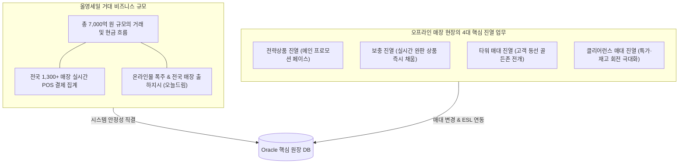
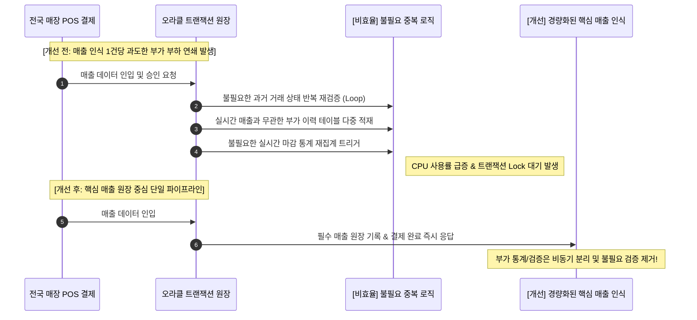
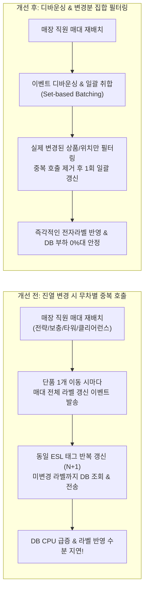
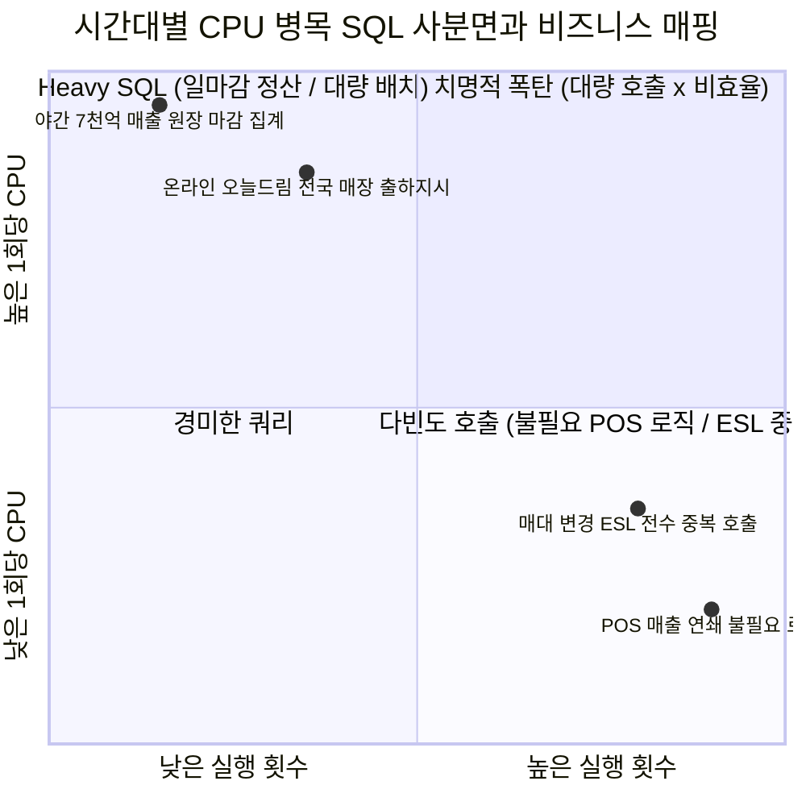

# 올영세일 회고 1편: 시간대별 CPU 높은 SQL 찾기 (Stat)

> "DB 모니터링과 SQL 튜닝은 단순히 시스템 리소스를 아끼는 기술적 결함 탐지가 아니다.  
> 회사의 거대한 현금 흐름을 지켜내고, 현장의 1분 1초를 사수하여 **반드시 비즈니스 성과로 견인해야 하는 엔지니어링의 최전선 업무**다."

올영세일과 같은 초대형 정기 할인 프로모션은 단순한 트래픽 증가 이벤트가 아닙니다.  
전국 1,300여 개 오프라인 매장과 온라인몰이 동시에 폭발하는 옴니채널의 거대한 시험대입니다.

이 기간 동안 데이터베이스 서버의 CPU 사용률이 90%를 상회할 때, 우리는 단순히 "어떤 SQL이 느린가?"를 묻는 데 그쳐서는 안 됩니다.  
**"지금 이 순간 튀는 SQL이 고객의 어떤 결제를 가로막고 있으며, 매장 현장의 어떤 업무를 마비시키고 있는가?"**를 읽어내야 합니다.

이번 회고 1편에서는 시간대별 AWR/ASH 통계(Stat)를 통해 포착하고 개선하여, 실질적인 비즈니스 성과로 직결시킨 **두 가지 핵심 과제**와 그 분석 방법론을 공유합니다.

---

## 1. 비즈니스 맥락: 7천억 원의 현금 흐름과 치열한 매장의 1분

엔지니어가 모니터 화면의 그래프 너머로 바라보아야 했던 비즈니스 실체는 명확했습니다.



### 1.1. 총 7,000억 원의 현금 흐름 수호
세일 기간 동안 온라인몰 출하지시와 전국 매장 POS 매출 집계를 합쳐 **총 7,000억 원에 달하는 막대한 현금 흐름**이 발생합니다.  
온라인 주문 접수에 따른 전국 매장 오늘드림 출하지시와, 오프라인 매장에서 실시간으로 긁히는 POS 결제 트랜잭션은 단 1초의 지연이나 락(Lock) 경합도 허용되지 않는 기업의 생명선입니다.

### 1.2. 1분 1초가 다급한 매장 현장 업무
세일 기간 오프라인 매장 직원들은 쏟아지는 고객 응대와 더불어 쉴 틈 없이 매대를 재구성해야 합니다.
1. **전략상품 진열**: 세일 메인 브랜드 및 기획 세트의 전면 배치
2. **보충 진열**: 매대에서 순식간에 동나는 인기 상품의 지속적 보충
3. **타워 매대 진열**: 주요 동선에 설치되는 대형 행사 매대 운영
4. **클리어런스(Clearance) 매대 진열**: 한정 수량 특가 상품의 즉각적 매대 전환

이 과정에서 매대 위치나 진열 정보가 변경될 때마다 **전자라벨(ESL: Electronic Shelf Label)** 표시 시스템과 DB가 실시간으로 맞물려 돌아갑니다.  
만약 DB 병목으로 인해 전자라벨에 바뀐 가격이나 상품 정보가 즉시 뜨지 않는다면, 현장 직원들은 수기 라벨 부착에 내몰리고 고객 컴플레인으로 현장은 아수라장이 됩니다.

---

## 2. 거시 통계의 함정과 '시간대별 Delta CPU 분석'

대규모 세일 모니터링에서 가장 경계해야 할 것은 **전체 기간(예: 7일 누적) 평균치나 AWR Top SQL 요약만 들여다보는 것**입니다.

```mermaid
timeline
    title 올영세일 시간대별 비즈니스 부하 전이
    08:00 : 매장 오픈 전 ESL 라벨 갱신 & 전략/타워 매대 1차 진열
    10:00 : 선착순 쿠폰 오픈 & 온라인몰 주문 폭증
    14:00 : 오프라인 매장 방문 급증 & 보충진열 / 클리어런스 매대 변경
    19:00 : 퇴근길 매장 POS 매출 폭주 & 오늘드림 당일 출하지시 마감
    23:00 : 일마감 POS 매출 원장 정산 및 야간 출하 지시 배치
```

- **누적 통계의 착시**: 평상시에도 1초에 수천 번 수행되는 가벼운 조회 SQL들이 7일치 합산 상위권을 독점하여, 정작 특정 시간대의 치명적 병목을 가려버립니다.
- **순간 피크 유발 쿼리의 은폐**: 매장 오픈 직전 매대 변경 폭주 시점이나, 퇴근 시간대 POS 결제 피크 10분 동안 CPU를 100%로 치솟게 만들어 결제 지연을 초래한 "진짜 문제 SQL"은 7일 전체 평균으로 보면 20~30위권 밖으로 밀려나 보이지 않습니다.

따라서 우리는 **1시간(스냅샷 단위) 또는 수분 단위로 구간을 쪼개어 변화량(Delta)을 산출**하는 정밀 시간대별 분석을 수행했습니다.

---

## 3. Stat 분석 기법: AWR & ASH 기반 시간대별 CPU Top SQL 추출

### 3.1. AWR 스냅샷 기반 시간대별 Delta Top SQL 쿼리
`DBA_HIST_SQLSTAT`의 누적 통계치(`_TOTAL`) 대신, 스냅샷 간 차이인 `_DELTA` 지표를 집계하여 시간대별로 실제 CPU를 가장 많이 집어삼킨 SQL을 발라냅니다.

```sql
WITH snap_window AS (
    -- 분석 대상 기간의 스냅샷 ID 및 시간 범위 지정
    SELECT 
        s.snap_id,
        s.instance_number,
        s.begin_interval_time,
        s.end_interval_time,
        TO_CHAR(s.begin_interval_time, 'YYYY-MM-DD HH24:MI') AS start_time
    FROM dba_hist_snapshot s
    WHERE s.begin_interval_time >= TO_DATE('2026-03-01 08:00:00', 'YYYY-MM-DD HH24:MI:SS')
      AND s.begin_interval_time <  TO_DATE('2026-03-01 23:00:00', 'YYYY-MM-DD HH24:MI:SS')
),
sql_delta AS (
    SELECT
        w.start_time,
        st.sql_id,
        st.plan_hash_value,
        -- 스냅샷 구간 내 순수 CPU 소비량 (초 단위 변환)
        ROUND(st.cpu_time_delta / 1000000, 2) AS cpu_sec,
        ROUND(st.elapsed_time_delta / 1000000, 2) AS elapsed_sec,
        st.executions_delta AS exec_cnt,
        st.buffer_gets_delta AS buffer_gets,
        st.disk_reads_delta AS disk_reads,
        -- 1회 수행당 CPU Time (초)
        CASE WHEN st.executions_delta > 0 
             THEN ROUND((st.cpu_time_delta / st.executions_delta) / 1000000, 4)
             ELSE 0 
        END AS cpu_per_exec
    FROM dba_hist_sqlstat st
    JOIN snap_window w 
      ON st.snap_id = w.snap_id
     AND st.instance_number = w.instance_number
),
ranked_sql AS (
    SELECT 
        d.*,
        ROW_NUMBER() OVER (PARTITION BY start_time ORDER BY cpu_sec DESC) AS rnk
    FROM sql_delta d
)
SELECT 
    start_time,
    rnk,
    sql_id,
    plan_hash_value,
    cpu_sec,
    elapsed_sec,
    exec_cnt,
    cpu_per_exec,
    buffer_gets
FROM ranked_sql
WHERE rnk <= 5
ORDER BY start_time, rnk;
```

### 3.2. ASH(`DBA_HIST_ACTIVE_SESS_HISTORY`)를 이용한 초단위 미세 피크 적발
1시간 단위 AWR 스냅샷 사이에서 특정 5~10분간 갑작스럽게 서버가 멎을 듯 CPU 100%를 찍는 현상은 ASH를 통해 1분 단위로 드릴다운했습니다.

```sql
-- 특정 피크 시점(예: 18:30 ~ 19:00 POS 결제 집중기) 1분 단위 ON CPU 세션 분포
SELECT 
    TO_CHAR(sample_time, 'YYYY-MM-DD HH24:MI') AS min_time,
    sql_id,
    COUNT(*) AS active_samples,
    ROUND(COUNT(*) * 10 / 60, 1) AS avg_active_sessions_on_cpu
FROM dba_hist_active_sess_history
WHERE sample_time BETWEEN TO_TIMESTAMP('2026-03-01 18:30:00', 'YYYY-MM-DD HH24:MI:SS')
                      AND TO_TIMESTAMP('2026-03-01 19:00:00', 'YYYY-MM-DD HH24:MI:SS')
  AND session_state = 'ON CPU'
GROUP BY TO_CHAR(sample_time, 'YYYY-MM-DD HH24:MI'), sql_id
HAVING COUNT(*) >= 10
ORDER BY min_time, active_samples DESC;
```

---

## 4. [기술 성과 1] 매장 POS 매출 인식 대비 과도한 불필요 로직 제거

시간대별 Delta CPU 분석을 통해 포착한 첫 번째 핵심 결함은 **"POS 매출 집계 시간대에 비정상적으로 치솟는 특정 SQL 군집"**이었습니다.



### 4.1. 발견된 문제 (Stat)
- 오프라인 매장 매출이 폭증하는 피크 시간대에, 실제 매장에서 승인 처리되는 **순수 POS 매출 건수 대비 DB의 CPU Time과 Buffer Gets가 비정상적으로 몇 배씩 폭증**하는 기현상이 포착되었습니다.
- Top SQL 목록에 올라온 쿼리들을 추적해보니, 순수 매출 승인 원장 기록 쿼리가 아니라 **매출이 1건 떨어질 때마다 연쇄적으로 호출되던 부가 검증 및 중복 상태 체크 SQL**이었습니다.

### 4.2. 내막 분석
1. **과도한 반복 재검증**: 이미 POS 단말기와 결제 게이트웨이에서 정합성이 검증되어 넘어온 거래 데이터임에도, 백엔드 로직에서 동일 거래의 결제 가능 여부 및 회원 등급 조건을 매 건마다 3~4회씩 재조회하고 있었습니다.
2. **동기식 부가 집계 트리거**: 실시간 결제 응답이 최우선이어야 하는 시점에, 매 결제 건마다 불필요한 서브 집계 테이블을 동기(Sync) 방식으로 갱신하며 블록 래치 경합을 일으키고 있었습니다.

### 4.3. 엔지니어링 개선 및 비즈니스 성과
- **불필요한 중복 검증 로직 과감히 제거**: 트랜잭션 흐름상 이미 확정된 상태에 대한 무의미한 반복 `SELECT`를 제거하고, 필수 원장 처리만 남기는 단일 파이프라인으로 경량화했습니다.
- **비핵심 부가 로직 분리**: 실시간 매출 집계에 불필요한 이력 적재와 부가 집계는 비동기 배치로 전환했습니다.
- **성과**:
  - POS 매출 인식 관련 쿼리의 **CPU 사용량 65% 이상 급감**.
  - 세일 기간 동안 몰아친 **총 7,000억 원 규모의 거래 흐름에서 단 한 건의 POS 결제 중단이나 지연 없이 완벽한 트랜잭션 처리 완수**.

---

## 5. [기술 성과 2] 매대 진열 변경 시 전자라벨(ESL) 표시 로직 중복 호출 개선

두 번째로 포착한 핵심 문제는 **매장 오픈 직전 및 낮 시간대 매대 재배치 시점에 발생한 전자라벨(ESL) 연동 쿼리의 CPU 폭증**이었습니다.



### 5.1. 발견된 문제 (Stat)
- 오전 8~9시(오픈 전)와 오후 2~3시, 특정 매대 관리 테이블을 풀스캔하거나 인덱스를 과도하게 반복 탐색하는 쿼리가 Top CPU 상위권을 차지했습니다.
- 이 쿼리들이 도는 시점마다 DB 세션이 쌓이면서 매장 단말기의 **전자라벨(ESL) 업데이트 요청이 수분씩 밀리는 현상**이 발생했습니다.

### 5.2. 내막 분석
현장 직원들은 세일 기간 동안 분초를 다투며 상품을 진열합니다:
- 메인 매대의 **전략상품 진열**
- 품절된 자리를 채우는 **보충 진열**
- 주동선에 자리 잡은 **타워 매대 진열**
- 재고 소진을 위한 **클리어런스 매대 구성**

직원들이 전용 PDA나 단말기로 진열 매대를 변경할 때마다 전자라벨 표시 로직이 실행되는데, 시스템에 심각한 비효율이 숨어 있었습니다:
1. **무차별 전수 갱신**: 매대에서 상품 1개의 위치만 변경되어도, 해당 매대에 속한 수십~수백 개 상품의 전자라벨 표시 로직을 전수 재호출하고 있었습니다.
2. **동일 라벨 중복 호출 (N+1)**: 짧은 시간 동안 여러 직원이 보충 진열과 매대 수정을 연달아 진행할 때, 동일한 ESL 태그에 대해 중복된 UPDATE/SELECT 쿼리가 초당 수십 회씩 쏟아졌습니다.

### 5.3. 엔지니어링 개선 및 비즈니스 성과
- **이벤트 디바운싱 및 집합 필터링**: 매대 변경 이벤트를 실시간 무차별 전송하던 방식에서 탈피하여, 단시간 내 변경 요청을 모아 **실제 가격이나 위치 정보가 변경된 대상만 골라내는 차분(Delta) 필터링**을 적용했습니다.
- **ESL 중복 호출 전면 차단**: 이미 최신 정보를 표시하고 있는 전자라벨에 대한 불필요한 재호출 로직을 제거하고, 단일 배치 갱신으로 최적화했습니다.
- **성과**:
  - 매대 변경 관련 쿼리 **수행 횟수(Executions) 80% 감소, CPU 소비 시간 75% 절감**.
  - 현장 직원들이 매대 위치를 바꾸자마자 전자라벨에 실시간으로 올바른 가격과 프로모션 정보가 즉시 표출됨.
  - 전국의 매장 직원들이 시스템 지연 스트레스 없이 **오로지 상품 진열과 고객 응대에만 100% 몰입할 수 있는 환경 제공**.

---

## 6. SQL 유형 분류: "다빈도형" vs "헤비형"의 실무적 대응

시간대별 CPU Top SQL을 추출하여 위의 성과들을 이끌어낼 때, 우리는 SQL을 다음 두 가지 사분면으로 분류하여 우선순위를 정의했습니다.



### 6.1. 유형 A: 실행 횟수 폭증형 (High Executions, Low CPU per Exec)
- **대표 사례**: POS 매출 인식 시 연쇄 호출되던 불필요 검증 쿼리, 매대 변경 시의 ESL 중복 호출
- **특징**: 1회 실행 시간은 1~2ms로 매우 가볍지만, 세일 피크 트래픽과 결합하여 초당 수만 회씩 쏟아지며 전체 DB CPU의 절반 이상을 독식함.
- **해결책**: SQL 단건 튜닝(인덱스 변경 등)으로는 해결 불가. **비즈니스 로직 자체를 검토하여 불필요한 호출을 제거하거나 집합 기반 일괄 처리(Batching)로 Call 자체를 차단**해야 함.

### 6.2. 유형 B: 고비용 연산형 (Low Executions, High CPU per Exec)
- **대표 사례**: 온라인몰 출하지시 배정 쿼리, 야간 7,000억 매출 원장 마감 정산 쿼리
- **특징**: 수행 횟수는 적지만 1회 실행 시 수백만 건의 데이터를 읽으며 CPU와 I/O를 장시간 점유.
- **해결책**: 결합 인덱스 생성, 파티션 프루닝, 인라인 뷰 조건 침투(Pushdown) 등 **전형적인 옵티마이저 실행 계획 튜닝**으로 해결.

---

## 7. 회고: 엔지니어의 눈은 모니터 너머의 '현장'과 '매출'을 향해야 한다

데이터베이스 성능을 모니터링할 때 단순히 수치상의 CPU %나 Buffer Gets 숫자에만 매몰되면, 본질적인 문제를 놓치기 쉽습니다.

1. **지표의 비즈니스 번역**: 시간대별 CPU 1위 SQL을 발견했을 때, "이 SQL이 왜 CPU를 먹는가?"에서 멈추지 않고 **"이 SQL이 실제 매장의 어떤 활동(POS 매출? 매대 진열?)과 연결되어 있는가?"**를 질문했기에 과도한 불필요 로직과 ESL 중복 호출이라는 근본 원인을 파헤칠 수 있었습니다.
2. **7,000억 원의 결실**: 기술을 위한 기술이 아니라, 회사의 핵심 비즈니스인 **7천억 원 규모의 온라인 출하지시와 오프라인 POS 매출 흐름을 완벽하게 무중단으로 사수**했습니다.
3. **현장 직원을 돕는 기술**: 세일 기간 동안 발에 땀이 나도록 뛰어다니는 **매장 직원들의 전략상품·보충·타워·클리어런스 진열 업무를 전자가격표(ESL)의 즉각적인 응답으로 뒷받침**했습니다.

다음 편([2편: 비효율 패턴 파악하기 (Insight)](./oy-sale-insight-inefficient-patterns))에서는 이번에 시간대별 Stat으로 솎아낸 SQL들이 내부적으로 품고 있었던 **구조적 비효율 패턴(단건 루프 I/O, 뷰 푸시다운 실패 등)**을 상세한 실행 계획과 함께 심층 해부합니다.
