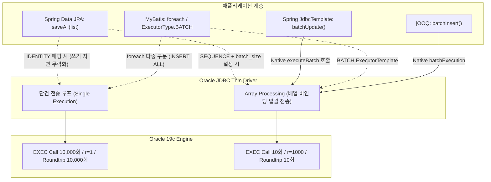

# Spring에서는 실제로 bulk insert 처리를 하는지? Oracle 트레이스 로그로 확인하는 방법

대량 데이터를 데이터베이스에 적재하는 배치나 마이그레이션 작업을 구현할 때, 애플리케이션 코드에서는 보통 리스트나 컬렉션 단위로 데이터를 묶어서 넘긴다.  
Spring Data JPA의 `saveAll()`, MyBatis의 `<foreach>` 또는 `ExecutorType.BATCH`, JDBC의 `addBatch()`를 사용하면서 "DB 엔진에 일괄(Bulk)로 전달되어 한 번에 커밋될 것"이라고 기대하는 편이다.

하지만 실제 오라클(Oracle) 데이터베이스의 세션 통계나 SQL 트레이스를 확인해보면 기대와 전혀 다른 현상이 빈번하게 확인된다.  
10만 건의 데이터를 리스트로 넘겼음에도 오라클 엔진은 10만 번의 개별 INSERT Call을 처리하느라 네트워크 패킷을 10만 번 주고받거나, 심지어 행마다 개별 커밋(Commit)이 발생해 `log file sync` 대기 이벤트로 시스템 전체 I/O를 점유하기도 한다.

애플리케이션 계층의 '배치 코드'와 오라클 DB 엔진 내부의 '물리적 실행' 사이에 왜 이러한 괴리가 발생하는지, 그리고 이를 10046 Extended Trace와 딕셔너리 뷰를 통해 테이블 단위로 검증하는 방법을 정리한다.

---

## 1. 스프링의 오라클 데이터 액세스 기술 스택 조망

스프링(Spring) 생태계에서 오라클(Oracle) 데이터베이스에 접근하는 방식은 추상화 수준과 패러다임에 따라 크게 다음과 같이 구분된다. 실무에서는 단일 기술만 사용하기보다는, 일반 트랜잭션(OLTP)과 대량 배치(Batch)의 목적에 따라 기술을 조합하여 운용하는 편이다.

| 계층 / 범주 | 기술 스택 | 주요 특징 및 실무 용도 |
| :--- | :--- | :--- |
| **ORM / 도메인 중심** | **Spring Data JPA** (Hibernate) | 엔티티 객체 중심 모델링, 자동 더티 체킹, 일반 웹/API OLTP 표준 |
| | **Spring Data JDBC** | 영속성 컨텍스트(1차 캐시, 쓰기 지연) 없는 단순 객체-테이블 매핑 |
| **SQL 매퍼 / Type-Safe** | **MyBatis** | XML 기반 동적 SQL 매핑, 레거시 시스템 및 복잡한 수동 튜닝 쿼리 |
| | **jOOQ** | 자바 코드 기반 Type-Safe SQL 빌더, 오라클 특화 구문 및 금융/정산 쿼리 |
| **저수준 / Core JDBC** | **Spring JdbcTemplate** | 스프링 표준 JDBC 래퍼, **대용량 배치 적재(Spring Batch)의 표준** |
| | **Raw JDBC (Connection)** | 프레임워크 추상화 없는 순수 JDBC / OCI Direct Path 제어 |
| **비동기 / 논블로킹** | **Spring Data R2DBC** | WebFlux 비동기 이벤트 시스템용 논블로킹 드라이버 (`oracle-r2dbc`) |

---

## 2. 기술별 Bulk Insert 처리 메커니즘과 내부 함정

애플리케이션 개발자가 호출하는 메서드와 오라클 JDBC Thin 드라이버가 Net8 프로토콜을 통해 전송하는 물리적 패킷 사이에는 상당한 변환 계층이 존재한다.  
각 기술이 대량 INSERT를 내부적으로 어떻게 처리하며, 어떤 지점에서 배칭이 무력화되는지 살펴본다.



### 2.1. Spring Data JPA: `saveAll()`의 구조와 IDENTITY 전략의 한계
Spring Data JPA의 `SimpleJpaRepository.saveAll()` 메서드는 내부적으로 단순히 리스트를 순회하며 `save()`를 호출하는 루프로 구성되어 있다.

```java
@Transactional
@Override
public <S extends T> List<S> saveAll(Iterable<S> entities) {
    List<S> result = new ArrayList<>();
    for (S entity : entities) {
        result.add(save(entity));
    }
    return result;
}
```

JPA의 배치 처리는 영속성 컨텍스트의 **쓰기 지연(Write-Behind)** 저장소에 INSERT 쿼리를 모아두었다가, 트랜잭션 커밋 직전 `flush()` 시점에 `hibernate.jdbc.batch_size` 설정에 맞춰 JDBC `executeBatch()`로 전달하는 구조다.

여기서 오라클 환경에서 흔히 발생하는 함정은 PK 채번 전략이다:
- **`GenerationType.IDENTITY`**: Oracle 12c부터 지원하는 `IDENTITY` 컬럼을 매핑한 경우, 엔티티가 영속(Persistent) 상태가 되려면 1차 캐시의 식별자(PK)가 즉시 필요하다. 하지만 IDENTITY 전략은 DB에 실제 INSERT를 실행하기 전까지 ID 값을 알 수 없다. 따라서 하이버네이트는 **쓰기 지연을 강제로 비활성화**하고, `persist()` 호출 시점에 즉시 단건 INSERT 쿼리를 DB로 날린다. 결과적으로 `hibernate.jdbc.batch_size` 설정을 아무리 크게 주어도 완전히 무시되고 1건씩 단건 전송된다.
- **`GenerationType.SEQUENCE`**: 오라클 시퀀스를 사용하면 INSERT 실행 전에 시퀀스 값을 먼저 조회해 엔티티에 할당할 수 있으므로 쓰기 지연 배칭이 정상 동작한다. 단, 시퀀스의 `allocationSize`와 하이버네이트 설정(`order_inserts=true`, `batch_size=1000`)을 일치시키지 않으면 시퀀스 조회를 위해 수만 번의 `SELECT ... NEXTVAL` 라운드트립이 선행된다.

---

### 2.2. Spring JdbcTemplate: 가장 직관적이고 강력한 Native Array Processing
Spring Batch를 비롯한 대용량 데이터 처리에서 JPA 대신 `JdbcTemplate`이 표준으로 권장되는 이유는 **추상화 계층 없이 JDBC의 네이티브 Array Processing을 직접 호출하기 때문**이다.

```java
jdbcTemplate.batchUpdate(
    "INSERT INTO tb_order_item (item_id, item_name, price) VALUES (?, ?, ?)",
    new BatchPreparedStatementSetter() {
        @Override
        public void setValues(PreparedStatement ps, int i) throws SQLException {
            OrderItem item = items.get(i);
            ps.setLong(1, item.getId());
            ps.setString(2, item.getName());
            ps.setBigDecimal(3, item.getPrice());
        }
        @Override
        public int getBatchSize() {
            return items.size();
        }
    }
);
```

- **내부 메커니즘**: `JdbcTemplate.batchUpdate()`는 내부적으로 단일 `PreparedStatement`를 생성하고 루프를 돌며 바인드 파라미터를 메모리에 적재한 뒤, 지정된 배치 크기마다 `ps.executeBatch()`를 1회 호출한다.
- **오라클 연동**: Oracle JDBC Thin Driver의 SDU(Session Data Unit) 버퍼에 2차원 바인드 배열이 패키징되어 한 번에 오라클 엔진으로 전송된다. 엔티티 상태 관리나 쓰기 지연 무력화 같은 부작용이 전혀 발생하지 않는다.

---

### 2.3. MyBatis: XML `<foreach>`의 물리적 한계 vs `ExecutorType.BATCH`
MyBatis 환경에서 대량 INSERT를 구현할 때 가장 흔히 시도하는 방식이 XML 동적 태그인 `<foreach>`다.  
오라클은 `INSERT INTO table VALUES (...), (...)` 멀티플 로우 구문을 지원하지 않으므로, 흔히 `INSERT ALL` 편법 구문을 사용한다.

```xml
<!-- [비권장] INSERT ALL을 이용한 다중 행 생성 -->
<insert id="insertBulkOrders">
    INSERT ALL
    <foreach collection="list" item="item">
        INTO tb_order_item (item_id, item_name, qty, price)
        VALUES (#{item.itemId}, #{item.itemName}, #{item.qty}, #{item.price})
    </foreach>
    SELECT * FROM dual
</insert>
```

이 방식의 물리적 한계:
1. **바인드 변수 한도 초과**: 오라클의 최대 바인드 파라미터 개수는 65,535개다. 컬럼이 10개인 테이블이라면 6,500건을 넘기는 순간 `ORA-01745: invalid host/bind variable name` 에러가 발생한다.
2. **하드 파싱 및 라이브러리 캐시 래치 경합**: 리스트 크기에 따라 매번 SQL 텍스트의 길이가 달라지고 바인드 변수 개수가 달라져 하드 파싱(Hard Parse)이 발생하며 Shared Pool 래치(`library cache: mutex X`)가 경합한다.

MyBatis에서 오라클의 네이티브 배칭을 활용하는 올바른 방법은 단건 INSERT XML 구문을 정의해두고, `SqlSessionTemplate`을 `ExecutorType.BATCH` 모드로 실행하는 것이다.

```java
// 동일 Statement를 재사용하며 JDBC Array Batch로 전송하는 정석 패턴
SqlSession sqlSession = sqlSessionFactory.openSession(ExecutorType.BATCH, false);
try {
    OrderMapper mapper = sqlSession.getMapper(OrderMapper.class);
    for (int i = 0; i < orderList.size(); i++) {
        mapper.insertOrderItem(orderList.get(i));
        if (i > 0 && i % 1000 == 0) {
            sqlSession.flushStatements(); // 1,000건 단위로 드라이버 버퍼 방출
        }
    }
    sqlSession.flushStatements();
    sqlSession.commit();
} finally {
    sqlSession.close();
}
```

---

### 2.4. jOOQ: Type-Safe SQL 빌더 관점의 벌크 인서트
jOOQ는 자바 코드로 SQL을 작성하므로 컴파일 타임 검증이 가능하며, 대량 적재 시 `batchInsert()` 메서드를 통해 네이티브 JDBC 배칭을 깔끔하게 지원한다.

```java
// jOOQ를 이용한 네이티브 Array Batch 실행
dslContext.batchInsert(records).execute();
```

- **내부 메커니즘**: 전달된 `Record` 목록을 기반으로 단일 INSERT 템플릿 Statement를 생성하고, `executeBatch()`를 호출하여 오라클 Thin Driver의 Array Processing을 활성화한다.
- **오라클 특화 최적화**: 대량 적재 시 오라클 Direct-Path Insert 힌트인 `/*+ APPEND */`나 대량 병합을 위한 `MERGE INTO` 구문을 타입 안전하게 조립할 수 있다는 점이 장점이다.

---

### 2.5. Commit 발생 단위와 `log file sync`
배치 작업의 처리 속도를 결정짓는 또 하나의 핵심 축은 **Commit 발생 빈도**다.

- **정상적인 트랜잭션 경계**: `@Transactional`이 전체 작업 외부에 선언되어 있거나 루프가 종료된 뒤 1회 커밋하면, 10만 건의 INSERT가 단건으로 쪼개져 전송되었든 배치로 전송되었든 오라클 엔진 레벨의 `user commits`는 **단 1회**만 발생한다.
- **루프 내부 Commit 또는 AutoCommit**: 루프 안에서 개별 메서드를 호출하며 트랜잭션이 열리고 닫히거나 Connection이 `autoCommit(true)` 상태라면 매 INSERT마다 커밋이 발생한다.
  - 오라클은 커밋 요청을 받는 즉시 LGWR(Log Writer)가 Redo Log Buffer의 변경 벡터를 디스크의 온라인 리두 로그 파일에 기록할 때까지 해당 세션을 대기시킨다.
  - 이 대기 이벤트가 바로 `log file sync`다.
  - 디스크 I/O 레이턴시가 1ms라고 가정할 때, 10만 번 커밋하면 순수 커밋 대기 시간만으로 100,000회 × 1ms = 약 100초가 소요된다.

---

## 3. 10046 Extended SQL Trace로 파헤치는 단건(r=1) vs 배치(r=1000) 물리적 차이

실제로 데이터가 어떻게 처리되고 있는지 오라클 엔진 수준에서 가장 확실하게 확인하는 방법은 **10046 Extended SQL Trace**를 확인하는 것이다.

### 3.1. 10046 Trace의 개념 및 진단 레벨
10046 이벤트는 오라클이 내부적으로 제공하는 확장 SQL 트레이스 이벤트다. 표준 SQL 트레이스(`SQL_TRACE=TRUE`)가 쿼리의 파싱, 실행, 페치 횟수와 CPU/I/O 총량만 기록하는 반면, 10046 이벤트는 **바인드 변수 실측값**과 **대기 이벤트(Wait Event)**를 마이크로초 단위로 기록한다.

| 진단 레벨 | 수집 내용 | 용도 |
| :--- | :--- | :--- |
| **Level 1** | 표준 SQL Trace (Parse/Execute/Fetch 통계, 처리 행 수) | 기본 실행 통계 확인 |
| **Level 4** | Level 1 + **바인드 변수 값 (Bind Variables)** | 바인드 파라미터 확인 |
| **Level 8** | Level 1 + **대기 이벤트 (Wait Events 및 대기 시간)** | I/O 및 락 병목 분석 |
| **Level 12** | Level 1 + Level 4 + Level 8 (바인드 변수 + 대기 이벤트 모두 수집) | **실무 표준 트레이스** |

### 3.2. 트레이스 활성화 및 수집 방법

#### 현재 세션에서 활성화 (단위 테스트 또는 테스트 쿼리)
```sql
-- 현대식 권장 방식 (DBMS_MONITOR 패키지)
EXEC DBMS_MONITOR.SESSION_TRACE_ENABLE(waits => TRUE, binds => TRUE);

-- 또는 전통적인 ALTER SESSION 방식 (Level 12)
ALTER SESSION SET EVENTS '10046 trace name context forever, level 12';

-- [배치 작업 실행]

-- 트레이스 종료
EXEC DBMS_MONITOR.SESSION_TRACE_DISABLE();
-- 또는
ALTER SESSION SET EVENTS '10046 trace name context off';
```

#### 타깃 WAS 세션(다른 세션) 추적 및 트레이스 활성화
실무 환경에서는 개발자 본인의 SQL 클라이언트 세션보다, Spring WAS(HikariCP)나 배치 서버가 맺고 있는 **다른 세션**을 대상으로 10046 트레이스를 걸어야 하는 경우가 대부분이다. 오라클은 관리자(DBA) 세션에서 다른 활성 세션을 지정해 10046 트레이스를 켜고 끌 수 있는 메커니즘을 제공한다.

##### 1) `DBMS_MONITOR` 패키지 사용 (표준 권장 방식)
대상 애플리케이션 세션의 `SID`와 `SERIAL#`를 `V$SESSION`에서 조회한 뒤 원격으로 활성화한다.

```sql
-- 1. 대상 배치 세션 확인 (예: 프로그램명이나 모듈명으로 탐색)
SELECT sid, serial#, username, osuser, program, module, status
FROM v$session
WHERE program LIKE '%java%' OR module LIKE '%Order%';

-- 2. 대상 세션(SID: 142, SERIAL#: 38192)에 10046 Trace (Level 12) 활성화
EXEC DBMS_MONITOR.SESSION_TRACE_ENABLE(session_id => 142, serial_num => 38192, waits => TRUE, binds => TRUE);

-- 3. 배치 작업 실행 확인 후 트레이스 비활성화
EXEC DBMS_MONITOR.SESSION_TRACE_DISABLE(session_id => 142, serial_num => 38192);
```

##### 2) HikariCP 커넥션 풀 환경: 모듈 또는 클라이언트 식별자 단위 추적
WAS의 커넥션 풀 환경에서는 작업이 어떤 세션(SID)으로 진입할지 사전에 특정하기 어려운 경우가 많다. 이 경우 세션 ID 대신 Spring에서 부여한 모듈명이나 클라이언트 식별자 단위로 트레이스를 걸 수 있다.

```sql
-- Spring 코드 또는 커넥션 초기화 시 client_identifier를 설정한 경우
-- 예: connection.setClientInfo("OCID_CLIENT_IDENTIFIER", "ORDER_BATCH_01");
EXEC DBMS_MONITOR.CLIENT_ID_TRACE_ENABLE(client_id => 'ORDER_BATCH_01', waits => TRUE, binds => TRUE);

-- 또는 Service / Module / Action 단위로 추적
EXEC DBMS_MONITOR.SERV_MOD_ACT_TRACE_ENABLE(service_name => 'APP_SVC', module_name => 'OrderBatchService', waits => TRUE, binds => TRUE);
```

##### 3) `ORADEBUG` 유틸리티 사용 (SYSDBA 전용)
SYSDBA 권한이 있는 경우 오라클 프로세스 레벨에서 직접 10046 이벤트를 주입할 수 있다.

```sql
-- 대상 세션의 오라클 SPID 또는 OS PID 지정
ORADEBUG SETORAPID 142; -- 오라클 세션 SID 지정
-- 또는
ORADEBUG SETOSPID 28419; -- OS 프로세스 ID(SPID) 지정

-- 10046 Level 12 활성화
ORADEBUG EVENT 10046 TRACE NAME CONTEXT FOREVER, LEVEL 12;

-- 비활성화
ORADEBUG EVENT 10046 TRACE NAME CONTEXT OFF;
```

---

#### 다른 세션의 트레이스 파일 물리 경로 확인 방법
현재 세션에서는 `SELECT value FROM v$diag_info WHERE name = 'Default Trace File';` 구문으로 바로 경로를 찾을 수 있지만, **다른 세션의 트레이스 파일은 해당 뷰에 나오지 않는다.**

트레이스 파일은 DB 서버(OS)의 백그라운드 Dedicated Server Process에 의해 기록되므로, `V$SESSION`과 `V$PROCESS`를 조인하여 **대상 세션의 서버 프로세스(`p.tracefile`)를 조회**해야 실제 파일 위치를 정확하게 찾아낼 수 있다.

```sql
SELECT 
    s.sid,
    s.serial#,
    s.username,
    s.program,
    s.module,
    p.spid AS os_pid,
    p.tracefile AS target_trace_file
FROM v$session s
JOIN v$process p ON s.paddr = p.addr
WHERE s.sid = :target_sid; -- 추적 대상 세션의 SID
```

출력 결과 예시:
```text
SID  SERIAL#  PROGRAM              OS_PID   TARGET_TRACE_FILE
---  -------  -------------------  -------  -------------------------------------------------------------
142    38192  JDBC Thin Client     28419    /u01/app/oracle/diag/rdbms/orcl/orcl/trace/orcl_ora_28419.trc
```

조회된 `TARGET_TRACE_FILE` 경로의 `.trc` 파일을 DB 서버 OS에서 열어보거나, `tkprof` 유틸리티를 실행해 분석한다.
```bash
tkprof /u01/app/oracle/diag/rdbms/orcl/orcl/trace/orcl_ora_28419.trc ./batch_report.txt sys=no sort=prsela,exeela,fchela
```

---

#### HikariCP + Spring Batch 다중 스텝 환경: SID가 계속 변경될 때의 실무 대처법
실제 Spring Batch 운영 환경에서는 청크(Chunk) 단위(`chunk-size: 1000`)마다 트랜잭션이 열리고 닫히며 커넥션이 HikariCP 풀에 반납(Check-in)된 후 다시 할당(Check-out)된다. 또한 Step이 변경되거나 멀티 스레드 파티셔닝(Partitioning)을 사용할 경우 **물리 커넥션인 오라클 SID가 청크와 스텝마다 계속해서 변경**된다.

이런 환경에서 특정 SID 하나만 지정하여 트레이스를 걸면 작업이 다른 세션으로 넘어가는 순간 수집이 누락된다. 실무에서는 다음 3가지 전략으로 대응한다.

##### 1) `CLIENT_IDENTIFIER` 기반 트레이스와 `trcsess` 병합 (표준 권장)
커넥션 풀이 어떤 물리 세션(SID)을 할당하든 상관없이, 애플리케이션 컨텍스트에서 오라클 식별자를 주입하고 해당 식별자 전체에 트레이스를 건다. 식별자를 주입하는 방법은 **`application.yml` 설정**과 **자바 코드(`StepExecutionListener`)** 둘 다 완벽하게 동작하며, 목적에 따라 선택할 수 있다.

###### 방법 A: `application.yml` 설정 (무중단/코드 변경 없음)
자바 코드를 수정하거나 재빌드할 필요 없이, HikariCP가 물리 커넥션을 맺을 때 오라클 세션에 식별자를 즉시 등록하도록 설정한다.

```yaml
spring:
  datasource:
    hikari:
      # 물리 커넥션 생성 즉시 Client ID 주입 (100% 정상 동작)
      connection-init-sql: "BEGIN DBMS_SESSION.SET_IDENTIFIER('BATCH_ORDER_STEP'); END;"
```
- **동작 원리**: HikariCP가 DB와 소켓을 열고 물리 커넥션을 풀에 넣을 때 위 PL/SQL을 1회 실행한다. 오라클 C 커널 내부의 세션 메모리(UGA)에 `client_identifier`가 즉시 기록되며 `V$SESSION.CLIENT_IDENTIFIER`에 영구 반영된다.
- **장점**: 코드 배포 없이 설정 파일만으로 즉시 적용 가능.
- **주의점**: 커넥션 풀 전체에 적용되므로, 웹 API와 배치가 커넥션 풀을 공유하는 공용 DataSource 환경보다는 **배치 전용 DataSource/프로파일**에 적용하는 것이 안전하다.

###### 방법 B: 자바 `StepExecutionListener` 설정 (스텝별 정교한 분리)
배치 내 여러 Step 중 특정 Step만 핀포인트로 추적하거나, Step별로 식별자를 다르게 쪼개고 싶을 때 사용한다.

```java
@Component
public class OracleTraceStepListener implements StepExecutionListener {

    @Autowired
    private DataSource dataSource;

    @Override
    public void beforeStep(StepExecution stepExecution) {
        // Step 시작 시 현재 물리 커넥션에 Client ID 주입
        try (Connection con = DataSourceUtils.getConnection(dataSource)) {
            // Oracle JDBC 드라이버 네이티브 키: OCID_CLIENT_IDENTIFIER
            con.setClientInfo("OCID_CLIENT_IDENTIFIER", stepExecution.getStepName());
        } catch (SQLException e) {
            // 예외 로깅
        }
    }

    @Override
    public ExitStatus afterStep(StepExecution stepExecution) {
        // Step 종료 후 커넥션 풀에 반납될 때 식별자 초기화 (풀 오염 방지)
        try (Connection con = DataSourceUtils.getConnection(dataSource)) {
            con.setClientInfo("OCID_CLIENT_IDENTIFIER", "");
        } catch (SQLException ignored) {}
        return stepExecution.getExitStatus();
    }
}
```
- **동작 원리**: JDBC 4.0 표준 `Connection.setClientInfo()`를 호출하면, Oracle JDBC 드라이버(Thin Driver)는 별도의 왕복 쿼리를 던지지 않고 다음 번 SQL Call을 보낼 때 Net8 프로토콜 패킷 헤더에 해당 메타데이터를 **피기백(Piggyback)**하여 오라클 엔진에 전송한다.
- **장점**: Step 1(`READ_STEP`), Step 2(`INSERT_STEP`)처럼 스텝 단위로 식별자를 동적으로 분리할 수 있다.

---

###### 두 방식의 동작 비교 요약
| 구분 | `application.yml` (`connection-init-sql`) | 자바 `StepExecutionListener` |
| :--- | :--- | :--- |
| **완벽 동작 여부** | **완벽 동작** (오라클 10g~23ai 표준) | **완벽 동작** (Oracle JDBC 드라이버 네이티브 지원) |
| **적용 단위** | 커넥션 풀(DataSource) 전체 세션 | 개별 Step 단위 (Step별 동적 변경 가능) |
| **코드 수정** | 없음 (yml 설정 및 재시작만 필요) | Listener 클래스 구현 및 등록 필요 |
| **권장 환경** | 배치 전용 앱의 쿼리/배칭 여부를 일괄 확인할 때 | 멀티 스텝 중 **특정 병목 스텝만 핀포인트로 추적**할 때 |

---

###### DBA 트레이스 활성화 및 `trcsess` 로그 병합
식별자가 주입되었다면, DBA 세션에서 단 한 줄로 트레이스를 시작하고 완료 후 파일을 병합한다.

```sql
-- SID와 무관하게 해당 Client ID를 달고 들어오는 모든 세션을 10046 추적
EXEC DBMS_MONITOR.CLIENT_ID_TRACE_ENABLE(client_id => 'BATCH_ORDER_STEP', waits => TRUE, binds => TRUE);

-- 배치 종료 후 비활성화
EXEC DBMS_MONITOR.CLIENT_ID_TRACE_DISABLE(client_id => 'BATCH_ORDER_STEP');
```

- **분산된 트레이스 파일 병합 (`trcsess`)**:  
SID가 바뀌어 DB 서버의 서로 다른 `.trc` 파일들에 로그가 쪼개져 저장되더라도, 오라클 공식 유틸리티인 `trcsess`로 Client ID 기준 단일 파일로 병합할 수 있다.
```bash
# DB 서버 trace 디렉토리에서 실행
trcsess output=merged_batch.trc clientid=BATCH_ORDER_STEP *.trc

# 병합된 파일을 tkprof로 분석
tkprof merged_batch.trc ./batch_summary.txt sys=no
```

##### 2) 검증 환경: HikariCP 커넥션 풀 크기를 1로 고정 (`max-pool-size: 1`)
로컬이나 스테이징 환경에서 배치 배칭 메커니즘만 빠르게 검증할 때는 풀 크기를 강제로 1로 제한하여 물리 세션을 단일화하는 방법이 가장 직관적이다.

```yaml
spring:
  datasource:
    hikari:
      maximum-pool-size: 1   # 풀 크기를 1로 고정하여 동일 SID 재사용 강제
      connection-init-sql: "ALTER SESSION SET EVENTS '10046 trace name context forever, level 12'"
```
Spring Batch가 수십 개의 Step과 청크를 반복해도 단 1개의 물리 커넥션(동일 SID)만 재사용되므로 단 하나의 `.trc` 파일로 전체 흐름을 검증할 수 있다.

##### 3) SID 무관: SQL_ID 기반 통계 추적 (`V$SQL`)
트레이스 파일 접근 권한이 없거나 운영 환경이라면, 세션 번호(SID)를 추적할 필요 없이 대상 INSERT 구문의 `SQL_ID`를 확인한다.  
HikariCP가 커넥션을 100번 갈아타며 실행했더라도, 오라클 라이브러리 캐시는 세션과 무관하게 동일 `SQL_ID`의 `EXECUTIONS`와 `ROWS_PROCESSED`를 누적 집계하므로 `rows_per_exec` 지표를 통해 배칭 여부를 즉시 검증할 수 있다.

---

### 3.3. 원시 트레이스(Raw Trace) 라인 비교

생성된 `.trc` 파일의 내부 텍스트 라인을 열어보면 단건 처리와 배치 처리의 차이가 명확하게 드러난다.

#### 단건 처리 로그: 1만 건 반복 실행 (`r=1`)
```text
-- 1번째 행 실행
BINDS #140239120:
 bind 0: dty=2 mxl=22(22) mal=00 scl=00 pre=00 oacflg=03 cobflg=00 val=10001
 bind 1: dty=1 mxl=32(04) mal=00 scl=00 pre=00 oacflg=03 cobflg=00 val="ITEM_A"
EXEC #140239120:c=0,e=25,p=0,cr=1,cu=3,mis=0,r=1,dep=0,og=1,plh=31245,tim=17261424001000
WAIT #140239120: nam='SQL*Net message to client' ela= 1 driver id=1413697536 #bytes=1 p3=0
WAIT #140239120: nam='SQL*Net message from client' ela= 180 driver id=1413697536 #bytes=1 p3=0

-- 2번째 행 실행
BINDS #140239120:
 bind 0: dty=2 mxl=22(22) mal=00 scl=00 pre=00 oacflg=03 cobflg=00 val=10002
 bind 1: dty=1 mxl=32(04) mal=00 scl=00 pre=00 oacflg=03 cobflg=00 val="ITEM_B"
EXEC #140239120:c=0,e=23,p=0,cr=1,cu=3,mis=0,r=1,dep=0,og=1,plh=31245,tim=17261424001210
WAIT #140239120: nam='SQL*Net message to client' ela= 1 driver id=1413697536 #bytes=1 p3=0
WAIT #140239120: nam='SQL*Net message from client' ela= 175 driver id=1413697536 #bytes=1 p3=0

... (동일한 블록이 10,000번 반복 기록됨) ...
```

#### 배치 처리 로그: 1,000건 단위 Array Processing (`r=1000`)
```text
-- 1번째 배치 실행 (1,000건 바인드 배열 전송)
BINDS #140239120:
 Array Bind: 1000 elements processed
 bind 0: dty=2 mxl=22(22) mal=1000 ...
 bind 1: dty=1 mxl=32(32) mal=1000 ...
EXEC #140239120:c=8000,e=9500,p=0,cr=5,cu=102,mis=0,r=1000,dep=0,og=1,plh=31245,tim=17261424002500
WAIT #140239120: nam='SQL*Net message to client' ela= 1 driver id=1413697536 #bytes=1 p3=0
WAIT #140239120: nam='SQL*Net message from client' ela= 220 driver id=1413697536 #bytes=1 p3=0

... (1만 건 처리 시 EXEC 라인이 단 10번만 찍히고 종료) ...
```

### 3.4. 내부 물리 동작의 본질적 차이

| 물리 지표 | 단건 처리 (`r=1`) | 배치 처리 (`r=1000`) | 동작 원리 차이 |
| :--- | :--- | :--- | :--- |
| **EXEC Call 수** | 10,000회 | 10회 | OCI/Net8 드라이버 패킷 전송 및 Context Switching 횟수 |
| **네트워크 대기** | `SQL*Net ... from client` 10,000회 | `SQL*Net ... from client` 10회 | 네트워크 라운드트립 지연 시간이 누적되지 않음 |
| **버퍼 블록 핀(Pin)** | 1건마다 핀 획득 $\rightarrow$ 해제 반복 | 블록 핀 유지 상태에서 연속 삽입 | `cache buffers chains` 래치 경합 급감 |
| **Current Gets (`cu`)** | 30,000 ~ 40,000회 | 1,000 ~ 1,500회 | 블록 헤더 ITL(Interested Transaction List) 갱신 비용 절감 |
| **Redo Vector 생성** | 행 단위 Redo 레코드 체이닝 | 다중 행 변경 벡터를 단일 Redo 레코드로 패키징 | Redo Log 버퍼 경합 완화 |

특히 중요한 점은 **데이터 블록 핀(Pin) 유지 메커니즘**이다.  
단건(`r=1`)으로 처리하면 오라클 엔진은 매 레코드마다 테이블 세그먼트의 타깃 블록을 버퍼 캐시에서 찾아 핀을 꽂고 행을 쓴 뒤 즉시 언핀(Unpin)한다. 다음 행이 물리적으로 동일한 블록에 저장되더라도 매번 해시 버킷 래치를 얻고 푸는 과정을 반복해야 한다.  
반면 Array Processing(`r=1000`)에서는 타깃 블록에 핀을 꽂은 채 블록의 여유 공간(Free Space)이 허용하는 한 여러 레코드를 연속해서 밀어 넣는다. 그 결과 Current Mode I/O를 나타내는 `cu` 지표가 20분의 1 수준으로 감소한다.

---

### 3.5. Trace 로그로 확인하는 Commit 시점 (`XCTEND`)

10046 Trace 파일에서 트랜잭션의 종료(커밋 또는 롤백)는 `XCTEND` 마커로 기록된다.

#### 케이스 A: 1건마다 Commit이 발생하는 로그
```text
EXEC #... r=1 ...
WAIT #... nam='log file sync' ela= 1120 buffer#=120 p3=0
XCTEND r=0, rd=0, shake=0, flag=2
WAIT #... nam='SQL*Net message to client' ela= 1 ...
WAIT #... nam='SQL*Net message from client' ela= 150 ...
EXEC #... r=1 ...
WAIT #... nam='log file sync' ela= 1080 buffer#=121 p3=0
XCTEND r=0, rd=0, shake=0, flag=2
```
매 `EXEC` 직후 LGWR가 Redo Log File에 기록할 때까지 세션이 대기하는 `log file sync`가 발생하고 즉시 `XCTEND`가 기록된다. 전체 소요 시간 중 대부분이 `log file sync` 대기 시간으로 채워진다.

#### 케이스 B: 1만 건 작업 후 마지막 1회 Commit 로그
```text
EXEC #... r=1000 ...
EXEC #... r=1000 ...
... (10회의 EXEC 동안 XCTEND와 log file sync가 전혀 나타나지 않음) ...
WAIT #... nam='log file sync' ela= 2100 buffer#=150 p3=0
XCTEND r=0, rd=0, shake=0, flag=2
```
1만 건이 모두 적재될 때까지 메모리(버퍼 캐시 및 언두 블록) 상에서만 트랜잭션이 유지되며, 작업이 끝난 뒤 단 1번의 `log file sync`와 `XCTEND`가 찍힌다.

---

## 4. 테이블 단위로 실시간 및 과거 커밋 실측치를 검증하는 방법

### 4.1. 실시간 검증 1: `V$SQL` (테이블 기준 `rows_per_exec`)
메모리(라이브러리 캐시)에 적재된 SQL 통계를 확인하여, 특정 테이블로 들어간 INSERT 구문이 1회 실행당 몇 행씩 처리되었는지를 확인한다.

```sql
SELECT 
    sql_id,
    plan_hash_value,
    executions,
    rows_processed,
    -- 1회 실행당 처리된 행 수 (핵심 지표)
    ROUND(rows_processed / NULLIF(executions, 0), 2) AS rows_per_exec,
    parse_calls,
    buffer_gets,
    ROUND(buffer_gets / NULLIF(rows_processed, 0), 2) AS buffers_per_row,
    ROUND(elapsed_time / 1000000, 2) AS elapsed_sec,
    sql_text
FROM v$sql
WHERE UPPER(sql_text) LIKE '%INSERT%TB_ORDER_ITEM%'
  AND UPPER(sql_text) NOT LIKE '%V$SQL%'
ORDER BY last_active_time DESC;
```

- **실측 해석**:
  - `EXECUTIONS = 10,000`, `ROWS_PROCESSED = 10,000` $\rightarrow$ `rows_per_exec = 1.00`: 애플리케이션 코드가 어떻게 작성되었든 오라클은 **1만 번 단건 실행**한 상태다.
  - `EXECUTIONS = 10`, `ROWS_PROCESSED = 10,000` $\rightarrow$ `rows_per_exec = 1000.00`: **1,000건 단위 Array Batch**로 정상 처리된 상태다.

---

### 4.2. 실시간 검증 2: `V$SESSTAT` (세션 기준 `user commits` & Roundtrips)
커밋이 1건마다 발생했는지, 트랜잭션 종료 시 1번만 발생했는지는 세션 통계에서 확인한다.

```sql
SELECT 
    s.sid,
    n.name,
    s.value
FROM v$sesstat s
JOIN v$statname n ON s.statistic# = n.statistic#
WHERE s.sid = :target_sid  -- 배치 수행 세션 SID
  AND n.name IN (
      'execute count',
      'user commits',
      'user rollbacks',
      'SQL*Net roundtrips to/from client',
      'bytes sent via SQL*Net to client',
      'redo entries',
      'redo size'
  );
```

- **실측 해석**:
  - 1만 건 처리 후 `user commits = 1` $\rightarrow$ 단일 트랜잭션 정상 커밋.
  - `user commits = 10,000` $\rightarrow$ 행마다 개별 커밋 발생.
  - `SQL*Net roundtrips to/from client`가 10,000 이상이면 네트워크 왕복이 병목을 유발하고 있음을 의미한다.

---

### 4.3. 실시간 검증 3: `V$LOCKED_OBJECT` + `V$TRANSACTION` (실시간 Undo 증가량 추적)
배치 작업이 진행 중일 때 타깃 테이블에 걸린 트랜잭션의 누적 반영 레코드 수를 실시간으로 확인한다.

```sql
SELECT 
    lo.session_id,
    o.owner,
    o.object_name,
    t.xidusn,
    t.xidslot,
    t.status,
    t.start_time,
    t.used_ublk,  -- 할당된 Undo 블록 수
    t.used_urec   -- 현재 트랜잭션에 기록된 Undo 레코드 수 (누적 변경 건수)
FROM v$locked_object lo
JOIN dba_objects o 
  ON lo.object_id = o.object_id
JOIN v$transaction t 
  ON lo.xidusn = t.xidusn 
 AND lo.xidslot = t.xidslot 
 AND lo.xidsqn = t.xidsqn
WHERE o.object_name = 'TB_ORDER_ITEM';
```

- **실측 해석**:
  - 조회를 반복할 때 동일한 트랜잭션 슬롯(`xidusn`, `xidslot`)이 유지되면서 `used_urec`가 100, 500, 1000, 5000으로 지속 증가한다면 하나의 트랜잭션 내에서 모아서 처리 중인 상태다.
  - 반면 조회를 할 때마다 트랜잭션 슬롯 번호가 바뀌거나 `used_urec`가 1로만 리셋된다면 건건이 커밋하며 트랜잭션을 닫고 새로 여는 상태다.

---

### 4.4. 과거 이력 검증: `DBA_` 딕셔너리 뷰를 통한 사후 실측

이미 배치가 종료되어 인메모리 뷰(`V$SQL`, `V$SESSTAT`)에서 데이터가 밀려난 경우, AWR 딕셔너리와 플래시백 뷰를 통해 과거 시점의 동작을 역추적할 수 있다.

#### 1) `DBA_HIST_SQLSTAT`: 과거 특정 SQL_ID의 1회당 행 수(`rows_per_exec`)
특정 일자, 특정 시간대 스냅샷 구간에 수행된 INSERT SQL의 실행 횟수 대비 처리 행 수 비율을 확인한다.

```sql
SELECT 
    sn.snap_id,
    TO_CHAR(sn.begin_interval_time, 'YYYY-MM-DD HH24:MI') AS begin_time,
    h.sql_id,
    h.plan_hash_value,
    h.executions_delta,
    h.rows_processed_delta,
    -- 과거 실행 당시 1회 Call당 처리된 평균 행 수
    ROUND(h.rows_processed_delta / NULLIF(h.executions_delta, 0), 2) AS rows_per_exec,
    h.buffer_gets_delta,
    ROUND(h.buffer_gets_delta / NULLIF(h.rows_processed_delta, 0), 2) AS buffers_per_row,
    ROUND(h.elapsed_time_delta / 1000000, 2) AS elapsed_sec
FROM dba_hist_sqlstat h
JOIN dba_hist_snapshot sn 
  ON h.snap_id = sn.snap_id 
 AND h.instance_number = sn.instance_number
WHERE h.sql_id = :target_sql_id
  AND sn.begin_interval_time BETWEEN TO_TIMESTAMP('2026-09-10 02:00:00', 'YYYY-MM-DD HH24:MI:SS')
                                 AND TO_TIMESTAMP('2026-09-10 04:00:00', 'YYYY-MM-DD HH24:MI:SS')
ORDER BY sn.snap_id;
```

#### 2) `DBA_HIST_ACTIVE_SESS_HISTORY` (AWR ASH): 과거 커밋 대기 이벤트 집중도 분석
해당 배치 시간대에 타깃 SQL_ID 또는 모듈에서 `log file sync` 대기가 집중되었는지 확인한다.

```sql
SELECT 
    ash.sql_id,
    ash.session_state,
    ash.event,
    COUNT(*) AS sample_count,
    -- AWR ASH는 10초 주기 샘플링이므로 샘플 수 * 10초로 대략적인 대기 시간 산출
    COUNT(*) * 10 AS est_wait_sec
FROM dba_hist_active_sess_history ash
JOIN dba_hist_snapshot sn 
  ON ash.snap_id = sn.snap_id 
 AND ash.instance_number = sn.instance_number
WHERE sn.begin_interval_time BETWEEN TO_TIMESTAMP('2026-09-10 02:00:00', 'YYYY-MM-DD HH24:MI:SS')
                                 AND TO_TIMESTAMP('2026-09-10 04:00:00', 'YYYY-MM-DD HH24:MI:SS')
  AND (ash.sql_id = :target_sql_id OR ash.event = 'log file sync')
GROUP BY ash.sql_id, ash.session_state, ash.event
ORDER BY sample_count DESC;
```
단건 커밋이 발생했다면 `log file sync` 이벤트가 압도적인 샘플 수로 집계된다.

#### 3) `DBA_HIST_SYSSTAT`: 스냅샷 구간별 시스템 전체 Commit 증분 확인
```sql
SELECT 
    s.snap_id,
    TO_CHAR(sn.begin_interval_time, 'YYYY-MM-DD HH24:MI') AS begin_time,
    s.value - LAG(s.value, 1) OVER (ORDER BY s.snap_id) AS commit_delta
FROM dba_hist_sysstat s
JOIN dba_hist_snapshot sn 
  ON s.snap_id = sn.snap_id 
 AND s.instance_number = sn.instance_number
WHERE s.stat_name = 'user commits'
  AND sn.begin_interval_time BETWEEN TO_TIMESTAMP('2026-09-10 01:00:00', 'YYYY-MM-DD HH24:MI:SS')
                                 AND TO_TIMESTAMP('2026-09-10 05:00:00', 'YYYY-MM-DD HH24:MI:SS')
ORDER BY s.snap_id;
```

#### 4) `FLASHBACK_TRANSACTION_QUERY`: 테이블 단위 과거 트랜잭션별 실제 커밋 이력 추적
오라클의 Undo 보존 기간(`undo_retention`) 내라면, 플래시백 트랜잭션 쿼리를 통해 특정 테이블에 발생한 트랜잭션 XID와 실제 커밋 시각, 처리 건수를 1건 단위로 완벽하게 복원하여 검증할 수 있다.

```sql
SELECT 
    xid,
    commit_scn,
    commit_timestamp,
    operation,
    table_name,
    COUNT(*) AS affected_rows
FROM flashback_transaction_query
WHERE table_name = 'TB_ORDER_ITEM'
  AND commit_timestamp >= TO_TIMESTAMP('2026-09-10 02:00:00', 'YYYY-MM-DD HH24:MI:SS')
  AND operation = 'INSERT'
GROUP BY xid, commit_scn, commit_timestamp, operation, table_name
ORDER BY commit_timestamp DESC;
```

- **실측 해석**:
  - **단일 커밋 증명**: 1개의 `xid`에 대해 `affected_rows = 10,000`이고 1개의 `commit_timestamp`만 출력된다. 1만 건이 단일 트랜잭션으로 커밋되었음을 물리적으로 확증할 수 있다.
  - **건건이 커밋 증명**: 서로 다른 수천~수만 개의 `xid`가 출력되고, 각각 `affected_rows = 1`이며 마이크로초 단위로 분리된 `commit_timestamp`가 찍힌다. 애플리케이션의 트랜잭션 경계 설정 오류를 완벽하게 입증할 수 있다.

---

## 5. 실무 점검 체크리스트

대량 INSERT 작업을 설계하거나 성능 이슈를 분석할 때 다음 체크리스트를 순서대로 확인한다.

| 점검 단계 | 점검 항목 | 정상 기준 | 비정상 시 조치 사항 |
| :--- | :--- | :--- | :--- |
| **JPA 엔티티 설계** | PK 채번 전략 | `GenerationType.SEQUENCE` 사용 | `IDENTITY` 사용 시 쓰기 지연 비활성화됨 $\rightarrow$ Sequence 전환 또는 JDBC Batch 분리 |
| **JPA 프로퍼티** | 배칭 옵션 활성화 | `batch_size: 500~1000`<br/>`order_inserts: true` | 미설정 시 JDBC addBatch 미호출 |
| **MyBatis 매퍼** | 배치 실행 모드 | `ExecutorType.BATCH` 모드 사용 | XML `<foreach>` 기반 다중 인서트 지양 (파싱/바인드 한도 초과 위험) |
| **트랜잭션 경계** | Commit 발생 주기 | 루프 외부 1회 커밋 (`user commits = 1`) | 루프 내 커밋 발생 시 `log file sync` 경합 유발 $\rightarrow$ 트랜잭션 범위 재조정 |
| **오라클 실측 지표** | 실행당 행 수 | `rows_per_exec` $\approx$ `batch_size` | `rows_per_exec = 1`이면 프레임워크 배칭 무력화 상태 확인 |
| **과거 이력 증빙** | 플래시백/AWR 추적 | `FLASHBACK_TRANSACTION_QUERY` 상 XID당 N건 집계 | XID당 1건 집계 시 트랜잭션 누수 증명 |

---

## 6. 마치며

애플리케이션 계층에서 리스트나 컬렉션을 넘기는 코드는 개발 편의성을 위한 추상화일 뿐, 데이터베이스 엔진 수준의 물리적 배칭을 보장하지 않는다.  
특히 JPA의 `IDENTITY` 전략과 하이버네이트 쓰기 지연 메커니즘의 충돌, MyBatis XML `<foreach>`의 파싱 부하 등은 겉으로 드러나지 않는 대표적인 성능 저하 원인이다.

배치 처리 성능에 의문이 생길 때는 로그에 찍히는 단순 실행 시간만 볼 것이 아니라, `10046 Trace`의 `r=` 수치와 `EXEC` 빈도, 그리고 `V$SQL` 및 `FLASHBACK_TRANSACTION_QUERY`의 실측 데이터를 통해 **실제로 DB Call과 Commit이 몇 번 일어났는가**를 직접 검증하는 접근이 필요하다.
