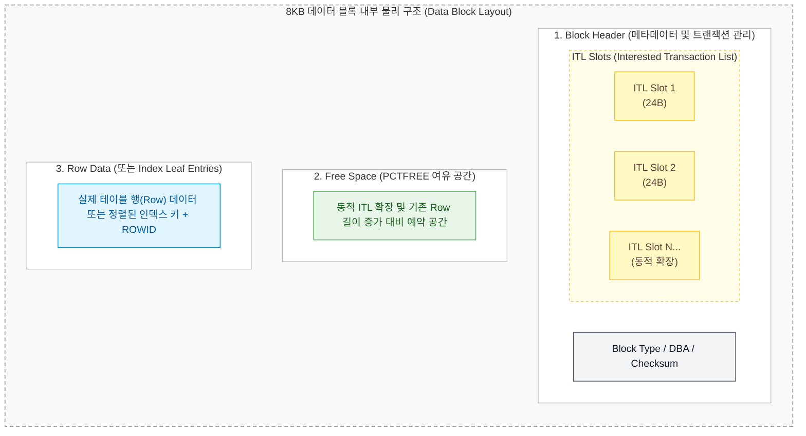
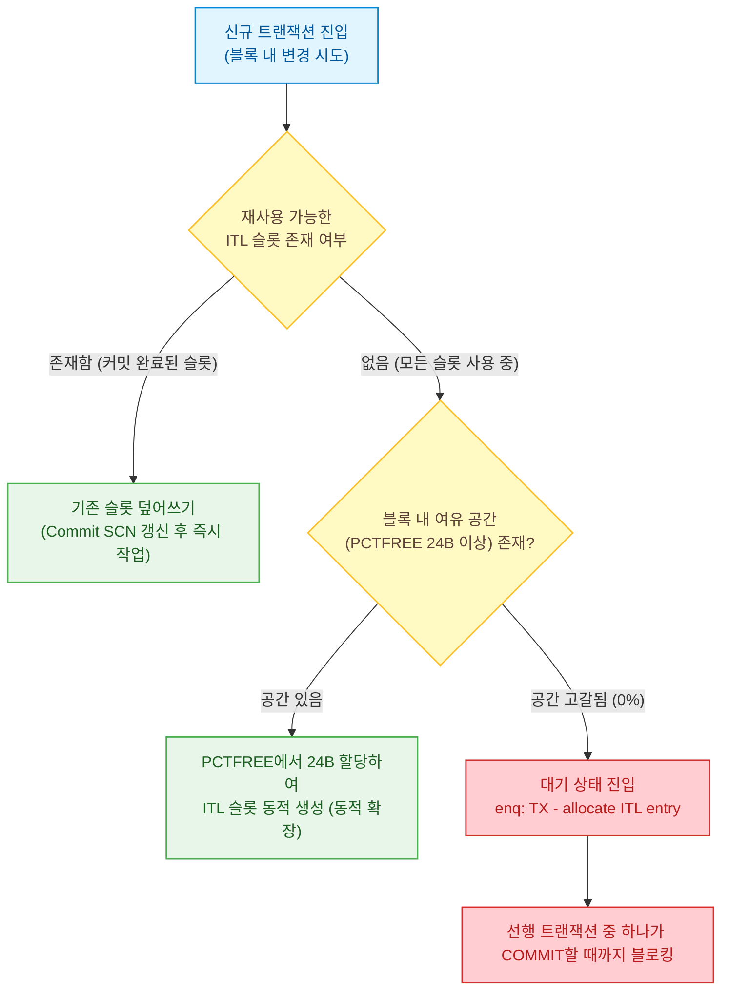
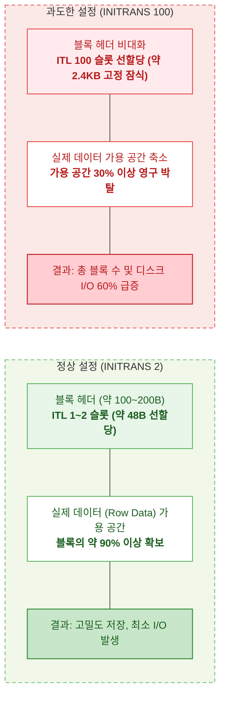
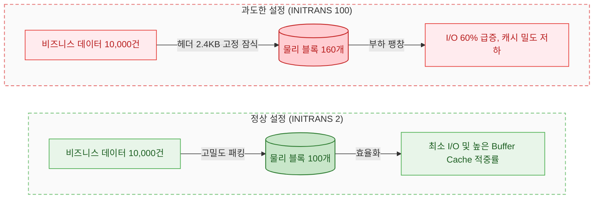
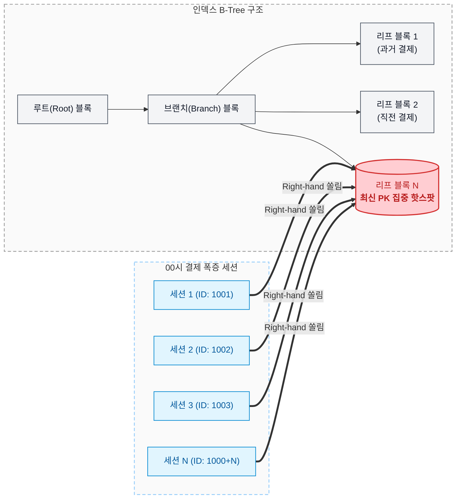
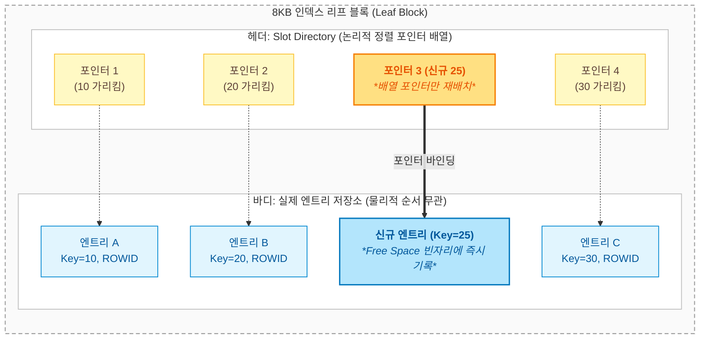
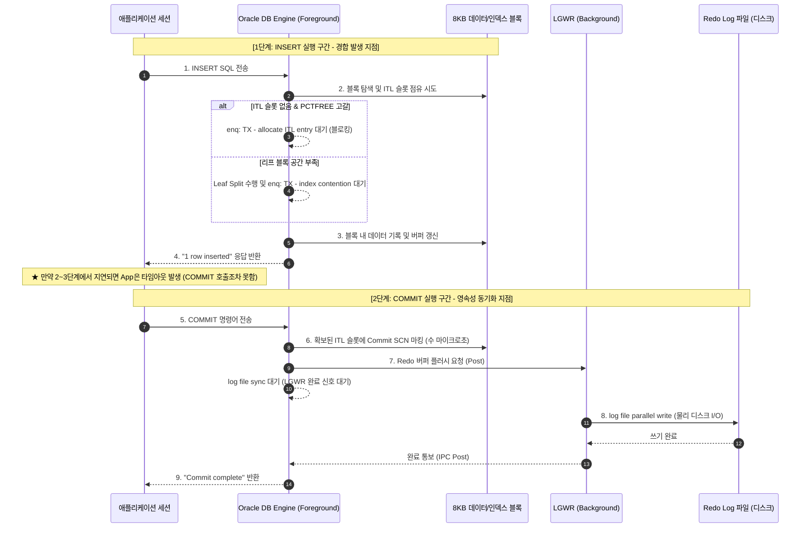
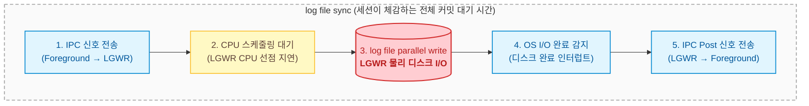
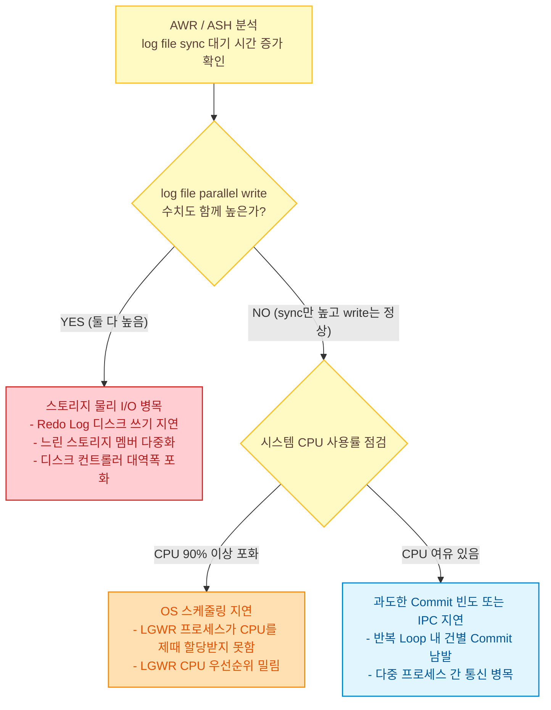

# 대규모 트랜잭션 환경의 결제 INSERT 내부 동작: ITL 경합, Leaf Split, COMMIT 동기화 대응

프로모션이나 타임 세일이 시작되는 00시 정각에는 온라인 주문과 결제 요청이 순간적으로 폭증한다.  
이 시점 결제 테이블(`PAYMENT`, `PAYMENT_HIST`)에는 초당 수천에서 수만 건에 달하는 INSERT 트랜잭션이 동시에 진입한다.

이때 애플리케이션 계층에서는 DB Connection Pool 전량 소진과 함께 `Socket read timed out` 에러가 발생하며 장애로 이어지는 경우가 있다.  
이러한 지연을 마주했을 때 흔히 두 가지 오판을 내리기 쉽다:
1. "커밋이 느려서 뒤로 다 밀리고 있다."
2. "블록 헤더 동시성 부족이니 INITRANS를 100 이상으로 대폭 올려두면 해결된다."

그러나 Oracle 데이터베이스의 내부 블록 아키텍처와 트랜잭션 처리 메커니즘을 분석해보면, 병목이 발생하는 실제 지점은 COMMIT 명령어가 아닌 선행 INSERT 단계의 물리 블록 경합이며, 무분별한 INITRANS 상향은 심각한 영구적 공간 낭비와 캐시 효율 저하를 부를 수 있으니 꼭 사전 주의를 요한다.

본 글에서는 00시 결제 폭증 상황에서 발생하는 물리 블록 레벨의 동작 과정, ITL과 인덱스 Leaf Split의 연쇄 영향, 그리고 대기 이벤트 분석을 통한 정확한 진단 기준을 정리한다.

---

## 1. 8KB 데이터 블록과 ITL(Interested Transaction List) 구조

Oracle의 최소 물리 I/O 및 저장 단위는 8KB 데이터 블록(Data Block)이다. 테이블 세그먼트와 인덱스 세그먼트 모두 이 8KB 블록을 동일하게 기본 단위로 사용한다.

<em>Figure 1: 8KB 데이터 블록 내부의 물리 계층 구조 및 ITL 슬롯 배치</em>

### 1.1. ITL 슬롯의 역할과 24바이트의 공간 소비
트랜잭션이 특정 블록 내부의 데이터를 수정(INSERT/UPDATE/DELETE)하려면, 먼저 해당 블록 헤더에 자신이 이 블록을 변경하고 있음을 등록해야 한다. 이 등록 장부가 바로 ITL(Interested Transaction List) 슬롯이다.
- **슬롯당 크기**: 슬롯 1개당 약 24바이트 고정 메모리 공간을 소비한다.
- **기록 내용**: XID(트랜잭션 식별자), UBA(Undo Block Address), Lock Flags, Commit SCN 등이 기록된다.
- **INITRANS**: 블록이 처음 포맷팅될 때 기본으로 확보해 둘 ITL 슬롯의 개수다. 테이블은 기본 1, 인덱스는 기본 2로 생성된다.

### 1.2. 동시 트랜잭션 유입 시 ITL 처리 흐름
복수의 세션이 동일한 8KB 블록에 동시에 접근해 서로 다른 행을 작업할 때, 블록 헤더 내부에서는 다음 순서로 슬롯 할당이 이루어진다.

<em>Figure 2: 동시 트랜잭션 유입 시 ITL 슬롯 할당 및 경합 메커니즘</em>

1. **슬롯 재사용**: 선행 트랜잭션이 COMMIT을 수행하면 해당 ITL 슬롯은 물리적으로 삭제되지 않는다. 슬롯 내부에 Commit SCN이 기록되면서 '재사용 가능' 마킹이 된다. 이후 들어온 세션은 이 슬롯을 다시 할당받아 즉시 사용한다.
2. **동적 확장**: 비어 있는 슬롯이 없고 동시 트랜잭션 수가 INITRANS를 초과하면, 블록 내 남아 있는 여유 공간(PCTFREE)에서 24바이트를 쪼개어 ITL 슬롯을 최대 MAXTRANS(10g 이후 255 고정)까지 동적으로 늘린다.
3. **ITL 경합 대기**: 블록이 데이터로 가득 차 여유 공간이 24바이트 미만으로 고갈되고 모든 슬롯이 작업 중이면, 세션은 슬롯을 얻지 못하고 `enq: TX - allocate ITL entry` 대기 상태로 멈춘다.

---

## 2. INITRANS 과대 설정의 역효과와 메커니즘

"동시 트랜잭션이 몰려 ITL 경합이 발생한다면, 테이블과 인덱스의 INITRANS를 100이나 150으로 넉넉하게 주면 되지 않는가?"라는 접근을 취하기 쉽다.  
하지만 이는 블록의 물리 저장 구조를 간과한 설정이며, 심각한 시스템 부작용을 동반한다.

### 2.1. 왜 미사용 슬롯이 '빈껍데기'로 방치되는가
INITRANS를 극단적으로 크게 설정했을 때 시스템 자원이 낭비되는 이유는 세 가지 물리적 특성 때문이다.

1. **무조건적인 선할당(Pre-allocation)**:  
   INITRANS는 필요할 때 늘어나는 값이 아니라, 블록이 생성되는 순간 데이터 유무와 관계없이 블록 헤더에 무조건 고정 크기로 생성된다.  
   `INITRANS 100`으로 설정하면 데이터가 1건도 없는 신규 블록이라도 헤더에 약 2.4KB(24B × 100, 전체 8KB 블록의 약 30%)를 즉시 못 박아 둔다.
2. **실제 운영 트랜잭션과의 차이**:  
   현실에서 특정 단일 8KB 블록을 100개 세션이 정확히 동일한 시점에 경합하며 수정을 가하는 상황은 극히 드물다. 대개 1~2개 트랜잭션이 거쳐 가며 즉시 커밋하고 슬롯을 반환한다. 결과적으로 100개 중 1~2개 슬롯만 사용되고, 나머지 98~99개 슬롯은 평생 비어 있는 백지 상태로 방치된다.
3. **데이터 영역으로 환원 불가**:  
   블록 헤더(ITL 슬롯 영역)와 바디(Row 저장 영역)는 구조적으로 엄격히 분리되어 있다. 트랜잭션이 사용하지 않는 빈 ITL 슬롯이라 하더라도, 그 공간을 데이터 Row 저장용으로 돌려주지 않는다. 즉, 블록이 삭제되거나 재생성되기 전까지 해당 2.4KB는 영구적으로 격리된다.

<em>Figure 3: INITRANS 설정에 따른 단일 8KB 블록 내 가용 공간 잠식 비교</em>

### 2.2. 연쇄적으로 발생하는 성능 저하 (나비효과)

블록당 담을 수 있는 유효 데이터가 줄어들면, 동일한 양의 비즈니스 데이터를 처리하기 위해 전체 아키텍처에 연쇄적인 부하가 발생한다.

<em>Figure 4: 동일 레코드 건수 저장 시 INITRANS 과대 설정에 의한 세그먼트 팽창 비교</em>

1. **세그먼트 전체 크기 팽창**:  
   블록당 수용 가능한 행 수가 감소하므로, 테이블과 인덱스가 요구하는 익스텐트(Extent)와 데이터 파일 스토리지 소비량이 수십 % 이상 급증한다.
2. **Buffer Cache 오염 및 적중률 저하**:  
   SGA의 Buffer Cache는 블록 단위(8KB)로 메모리에 적재된다. 블록 자체에 유효 데이터 밀도가 낮고 빈 헤더 공간만 가득 차 있으므로, 메모리 안에 "공기 반, 데이터 반" 상태의 블록들이 올라온다. 유효 데이터 관점의 캐시 밀도가 급격히 떨어져 Buffer Cache Hit Ratio가 하락한다.
3. **디스크 I/O 대폭 증가**:  
   Full Table Scan이나 Index Range Scan을 수행할 때 읽어야 하는 물리 블록 수가 비례해서 늘어난다. 디스크 스토리지 I/O 대역폭을 불필요하게 소모하여 전반적인 쿼리 Latency가 길어진다.
4. **인덱스 B-Tree Depth 증가**:  
   인덱스 리프 블록의 가용 공간 축소는 인덱스 키 수용 한계를 떨어뜨린다. 잦은 블록 분할(Leaf Split)이 발생하고, B-Tree의 깊이(Depth)가 2단계에서 3~4단계로 깊어진다. 이는 단건 조회를 포함한 모든 인덱스 탐색의 기본 I/O 비용을 영구적으로 증가시킨다.

---

## 3. 인덱스 블록 구조와 Right-hand Leaf Split 쏠림 현상

00시 결제 폭증 상황에서 ITL 경합이 테이블 블록보다 **인덱스 리프 블록**에서 훨씬 더 빈번하고 치명적으로 터지는 이유를 이해하려면, 인덱스의 물리 구조와 INSERT 시의 동작 방식을 파악해야 한다.

### 3.1. 테이블 블록 vs 인덱스 블록 비교
인덱스 역시 테이블스페이스의 기본 단위인 8KB 블록들로 구성되며, 헤더 구조(ITL 슬롯 포함)는 동일하다.

| 구분 | 테이블 데이터 블록 | 인덱스 리프(Leaf) 블록 |
| :--- | :--- | :--- |
| **블록 크기** | 기본 8KB | 기본 8KB |
| **블록 헤더** | ITL 슬롯, Row Directory 포함 | ITL 슬롯, Slot Directory 포함 |
| **저장 내용** | 행(Row) 전체 컬럼 데이터 | 정렬된 인덱스 키(Key) 값 + 테이블 ROWID |
| **블록당 엔트리 수** | 수십 ~ 수백 건 | **수백 ~ 수천 건 (고밀도 저장)** |
| **신규 데이터 분산** | 빈 여유 공간이 있는 여러 블록에 분산 적재 | **키 값의 정렬 순서에 따라 특정 리프 블록에 집중** |

### 3.2. 순차 증가 PK의 우측 리프 블록(Right-hand Leaf Block) 쏠림
결제 테이블의 PK는 주로 시퀀스 기반의 `PAYMENT_ID` 또는 `주문결제일시 + 일련번호` 형태로 생성된다.  
이러한 데이터는 값이 항상 오른쪽(최댓값) 방향으로 순차 증가한다.

<em>Figure 5: 순차 증가 PK 환경에서 발생하는 Right-hand Leaf Block 경합 구조</em>

- 테이블 블록은 여러 익스텐트의 가용 블록으로 분산되어 INSERT될 수 있지만, B-Tree 인덱스는 정렬 상태를 엄격히 지켜야 한다.
- 최댓값으로 밀려 들어오는 모든 결제 건은 **B-Tree의 맨 마지막 단 하나의 리프 블록(Right-hand Leaf Block)**으로만 집중된다.
- 결과적으로 8KB라는 좁은 단일 블록 하나에 수백 개의 세션이 동시에 진입하여 ITL 슬롯을 요구하게 되고, `enq: TX - allocate ITL entry` 경합과 버퍼 Pin 경합이 인덱스 쪽에서 집중적으로 발생한다.

### 3.3. INSERT 발생 시 인덱스 정렬의 본질 (Slot Directory 포인터 조작)
"INSERT가 발생할 때마다 인덱스 전체를 매번 다시 정렬하는가?"라는 의문이 생길 수 있다.  
결론부터 말하면 인덱스 전체를 정렬하지 않으며, 단일 리프 블록 내부에서도 물리적 데이터를 밀어내며 정렬하지 않는다.

1. **타겟 블록 탐색 (O(logN))**:  
   루트 블록에서 브랜치 블록을 거쳐 키 값을 비교하며 내려온다. 수천만 건의 데이터가 쌓여 있어도 B-Tree Depth(보통 2~4레벨)만큼의 블록만 읽으므로 수 마이크로초에서 수 밀리초 안에 타겟 리프 블록에 도달한다.
2. **슬롯 디렉토리(Slot Directory) 업데이트**:  
   리프 블록에 도착하면, 블록 내부의 기존 키 엔트리들을 물리적으로 한 칸씩 뒤로 밀어내지 않는다.
   - **실제 키+ROWID 엔트리**: 블록 내부의 남는 빈 공간(Free Space)에 순서와 상관없이 물리적으로 밀어 넣는다.
   - **정렬 순서 유지**: 블록 헤더에 있는 '슬롯 디렉토리(Slot Directory)'라는 2바이트짜리 포인터 배열에서 새 데이터의 위치를 가리키는 포인터만 순서에 맞게 끼워 넣는다.  
   따라서 단건 INSERT 시 인덱스 정렬 연산 자체의 CPU 부하는 매우 미미하다.

<em>Figure 6: 인덱스 리프 블록 내부의 Slot Directory 포인터 조작을 통한 정렬 메커니즘</em>

### 3.4. 진짜 부하 요인: Leaf Split (50:50 vs 99:1 Split)
단건 INSERT의 정렬 비용은 낮지만, 문제는 해당 8KB 리프 블록에 빈 공간이 더 이상 없을 때 발생한다. 이때 블록을 쪼개는 **Leaf Split**이 수행된다.

- **일반적인 분할 (50:50 Split)**:  
  중간 위치에 키가 삽입될 때 발생한다. 새 8KB 블록을 할당받아 기존 블록 엔트리의 절반을 새 블록으로 복사하고, 상위 브랜치 블록에 새 블록의 주소를 등록한다.
- **순차 증가 분할 (99:1 Split)**:  
  시퀀스나 현재 일시처럼 맨 우측 끝으로만 데이터가 들어올 때 발생한다. 기존 블록의 데이터는 그대로 둔 채 새 블록만 할당받아 맨 마지막 신규 엔트리만 새 블록으로 넘긴다.

Leaf Split이 진행되는 동안 해당 인덱스 블록에는 Exclusive 모드의 락이 걸리며, 새 블록 할당, 상위 브랜치 노드 갱신, 대량의 Redo/Undo 기록이 동반된다. 이 시간 동안 동일 리프 블록에 접근하려는 다른 세션들은 `enq: TX - index contention` 대기 상태로 줄줄이 멈춰 서게 된다.

### 3.5. UPDATE 시에도 발생하는 Leaf Split
UPDATE 문장 역시 인덱스 Leaf Split을 유발할 수 있다.  
인덱스 입장에서 인덱스 대상 컬럼의 UPDATE는 제자리 수정(In-Place Update)이 불가능하기 때문이다.

1. **DELETE + INSERT 처리**:  
   특정 컬럼 값이 바뀌면, 인덱스는 기존 키 값을 삭제 처리(Deleted 플래그 마킹)하고, 새로운 키 값을 B-Tree 정렬 위치에 맞춰 신규 INSERT한다.
2. **지연 회수와 공간 소진**:  
   Oracle 인덱스는 DELETE된 엔트리의 공간을 즉시 반환하지 않고 마킹만 유지한다. 따라서 동일 리프 블록 내에서 값이 미세하게 수정되더라도 기존 공간을 바로 덮어쓰지 못하고 새 엔트리가 추가된다.
3. **블록 분할 유발**:  
   결과적으로 블록 여유 공간이 빠르게 고갈되어 INSERT와 동일한 Leaf Split이 일어난다.  
   *(참고: 테이블 블록은 UPDATE로 인해 행 길이가 증가하여 자리가 모자라면 Split이 아닌 Row Migration이나 Row Chaining 현상이 발생한다.)*

---

## 4. 애플리케이션 관점의 대기 지점 분리: INSERT vs COMMIT

대규모 결제 트래픽 유입 시 애플리케이션의 타임아웃 로그(`Socket read timed out`)를 보면 "커밋이 느려서 서비스가 터졌다"고 오해하는 경우가 많다.  
그러나 트랜잭션의 실행 단계를 쪼개어 보면 지연이 발생하는 지점은 명확히 구분된다.

<em>Figure 7: INSERT 구간(물리 블록/ITL 경합)과 COMMIT 구간(디스크 영속화 동기화)의 대기 지점 분리</em>

### 4.1. INSERT 단계의 대기 (물리 블록 및 ITL 경합)
- **발생 시점**: 애플리케이션이 `INSERT INTO PAYMENT ...` 문장을 실행하는 즉시.
- **주요 대기 이벤트**: `enq: TX - allocate ITL entry`, `enq: TX - index contention`, `buffer busy waits`.
- **현상**: ITL 슬롯이 부족하거나 Leaf Split이 일어나는 동안 DB 엔진은 애플리케이션에 완료 응답("1 row inserted")을 주지 못하고 세션을 블로킹한다.
- **결과**: 애플리케이션은 **COMMIT 명령어를 DB 서버로 보내보지도 못한 채**, JDBC 드라이버의 Socket Read Timeout 한계에 도달해 에러를 뱉고 트랜잭션을 롤백한다.

### 4.2. COMMIT 단계의 대기 (디스크 영속화 동기화)
- **발생 시점**: INSERT가 성공적으로 끝나고 애플리케이션이 명시적으로 `COMMIT`을 호출했을 때.
- **주요 대기 이벤트**: `log file sync`.
- **동작 내용**: COMMIT은 새로운 ITL 슬롯을 찾거나 인덱스를 분할하지 않는다. 이미 INSERT 시점에 확보해 둔 내 ITL 슬롯에 Commit SCN 도장만 찍고 끝난다(수 마이크로초 소요).
- **진짜 대기 원인**: 트랜잭션의 ACID 영속성을 보장하기 위해, 메모리의 Log Buffer에 쌓인 Redo 내역을 LGWR(Log Writer) 백그라운드 프로세스가 디스크 상의 Redo Log 파일에 안전하게 쓸 때까지 세션이 대기하는 시간이다.

---

## 5. COMMIT 단계의 대기 분석: log file sync vs log file parallel write

COMMIT 구간에서 병목이 확인될 때, 문제의 원인이 스토리지 I/O인지, 아니면 다른 시스템 자원 부족인지를 판별하려면 `log file sync`와 `log file parallel write`의 관계를 정확히 이해해야 한다.

### 5.1. 두 이벤트의 명확한 차이점

| 구분 | log file sync | log file parallel write |
| :--- | :--- | :--- |
| **대기 주체** | 사용자 세션 (**Foreground Process**) | 백그라운드 프로세스 (**LGWR**) |
| **발생 시점** | 세션이 COMMIT 또는 ROLLBACK을 호출할 때 | LGWR이 Redo 버퍼 내용을 디스크의 Redo Log 파일에 기록할 때 |
| **측정 범위** | 커밋 요청 → LGWR 호출 → 디스크 쓰기 → 완료 신호 수신까지의 **전체 소요 시간** | OS를 통해 Redo Log 파일에 물리적으로 기록하는 **순수 디스크 I/O 시간** |
| **지표 성격** | 사용자 세션이 체감하는 포괄적 커밋 응답 시간 | 스토리지 인프라의 순수 물리 I/O 성능 지표 |

### 5.2. 두 이벤트의 포함 관계와 분해
사용자 세션이 겪는 `log file sync` 대기 시간 내부에는 LGWR의 물리 I/O 시간이 다음과 같이 포함되어 있다.

> **`log file sync`** ≈ LGWR 호출 및 스케줄링 지연 + **`log file parallel write`**(물리 디스크 I/O) + 완료 신호 수신(IPC)

<em>Figure 8: log file sync 대기 시간의 내부 소요 구간 분해</em>

### 5.3. AWR / ASH 진단 기준과 원인 분석

<em>Figure 9: log file sync 지연 발생 시 원인 규명을 위한 단계별 진단 결정 트리</em>

1. **`log file sync`와 `log file parallel write`가 둘 다 높은 경우**:  
   전형적인 스토리지 디스크 I/O 병목이다. LGWR이 디스크에 블록을 쓰는 속도 자체가 느려 Foreground 세션들이 줄줄이 대기하는 상태다. Redo Log가 위치한 디스크의 I/O 경합, 스토리지 Latency 지연, 다중화된 Redo Log 멤버 중 느린 디스크 포함 여부를 점검해야 한다.
2. **`log file sync`는 높은데 `log file parallel write`는 낮은 경우**:  
   디스크 쓰기 속도 자체는 정상(수 ms 이하)인데 세션들이 대기하고 있는 상황이다. 이는 I/O 문제가 아니다.
   - **과도한 Commit 빈도**: 루프문 내부 건별 커밋 등으로 수천 개의 세션이 동시에 LGWR에 신호를 쏟아부어 LGWR의 요청 큐가 포화된 경우다.
   - **OS CPU 고갈로 인한 LGWR 스케줄링 지연**: DB 서버의 전체 CPU 점유율이 90~100%에 육박하면서, LGWR 프로세스가 OS 스케줄러로부터 CPU를 즉각 할당받지 못해 깨어나는 시간이 지체되는 경우다.

---

## 6. 결제 테이블 대량 INSERT 실무 아키텍처 및 튜닝 가이드

00시 결제 폭증 환경에서 안정적인 처리 성능을 확보하기 위해 적용해야 하는 엔지니어링 원칙과 튜닝 방안은 다음과 같다.

### 6.1. INITRANS 튜닝의 올바른 기준
- **테이블**: 테이블 블록은 행 크기가 커서 블록당 들어가는 행 수가 제한적이므로, 특별한 경우가 아니면 기본값(1) 또는 2~4 수준이면 충분하다.
- **인덱스**: 순차 증가형 PK처럼 특정 리프 블록(Right-hand Leaf Block)에 극심한 동시 INSERT가 집중되는 인덱스에 한해 `INITRANS 5~20` 수준으로 상향 조정한다.
- **금기 사항**: ITL 경합이 관측된다고 해서 INITRANS를 50~100 이상으로 과도하게 올리는 행위는 가용 공간 축소와 Buffer Cache 밀도 저하를 유발하므로 절대 피해야 한다.

### 6.2. Right-hand Leaf Block 쏠림 분산 설계
단일 인덱스 리프 블록에 수천 개 트랜잭션이 쏠리는 물리적 구조 자체를 완화해야 한다.

1. **Hash Partitioning 적용**:  
   결제 테이블을 `ORDER_ID`나 `USER_ID` 기준으로 해시 파티셔닝(Hash Partitioning, 16개 또는 32개)하면, 신규 INSERT가 16~32개의 서로 다른 파티션 인덱스 세그먼트로 물리 분산된다. 결과적으로 핫스팟 리프 블록이 N개로 쪼개져 경합이 대폭 완화된다.
2. **Reverse Key Index의 신중한 검토**:  
   인덱스 키의 바이트를 역순으로 뒤집어 저장함으로써 순차 증가 값을 B-Tree 전체 리프 블록으로 고르게 흩뿌리는 기법이다.  
   - *주의점*: 동등 비교(`=`) 조건 검색만 가능하며, 일시 범위 검색(`BETWEEN`, `>=`) 시 Index Range Scan이 불가능하고 Full Table Scan으로 풀리는 트레이드오프가 존재하므로 단건 PK 조회 전용 테이블에 한해 제한적으로 적용해야 한다.
3. **Sequence Cache 상향**:  
   시퀀스를 사용할 경우 `CACHE 1000` 이상, 필요 시 `NOORDER` 옵션을 부여하여 시퀀스 자체의 딕셔너리 락(`row cache lock`, `enq: SV - contention`) 경합을 함께 방지한다.

### 6.3. 애플리케이션 트랜잭션 및 커밋 단위 최적화
- **불필요한 단건 커밋 남발 방지**: 대량 결제 처리 파이프라인에서 무의미한 건별 커밋을 지양하고 논리적 트랜잭션 단위로 일괄 처리하여 LGWR 호출 빈도를 안정화한다.
- **인덱스 수 최소화**: 결제 테이블에 불필요하게 많이 걸려 있는 인덱스는 INSERT 시마다 N개의 Leaf Split과 추가적인 ITL 경합을 유발하므로, 조회 패턴을 분석하여 사용하지 않는 인덱스를 과감히 정리한다.

---

## 7. 핵심 요약 및 점검 기준

대규모 결제 트래픽 환경에서 발생하는 INSERT 지연은 단순히 쿼리 튜닝이나 단일 파라미터 변경으로 해결되지 않는다. 물리 블록 헤더와 로그 동기화 구조를 종합적으로 진단해야 한다.

1. **대기 지점 식별**: 지연이 발생하는 순간의 AWR/ASH를 확인하여, `enq: TX - allocate ITL entry` / `enq: TX - index contention`(INSERT 단계)인지, `log file sync`(COMMIT 단계)인지 명확히 분리한다.
2. **무분별한 선할당 지양**: INITRANS 과대 설정은 선할당된 헤더 공간의 영구적 잠식, 세그먼트 팽창, Buffer Cache 오염을 초래하므로 핫스팟 인덱스에 한해 5~20 수준으로만 제한 상향한다.
3. **인덱스 물리 특성 이해**: 인덱스 리프 블록은 고밀도 정렬 구조이므로 순차 증가 PK 환경에서 우측 리프 블록 쏠림이 극대화된다. 물리 분산(파티셔닝 등)을 통해 핫스팟 블록을 분해하는 아키텍처적 접근이 필수적이다.
4. **COMMIT 지표 분해**: `log file sync`가 치솟을 때는 반드시 `log file parallel write`와 시스템 CPU 사용률을 대조하여, 스토리지 I/O 병목인지 LGWR CPU 스케줄링 지연인지를 정확히 판별하고 대응한다.
