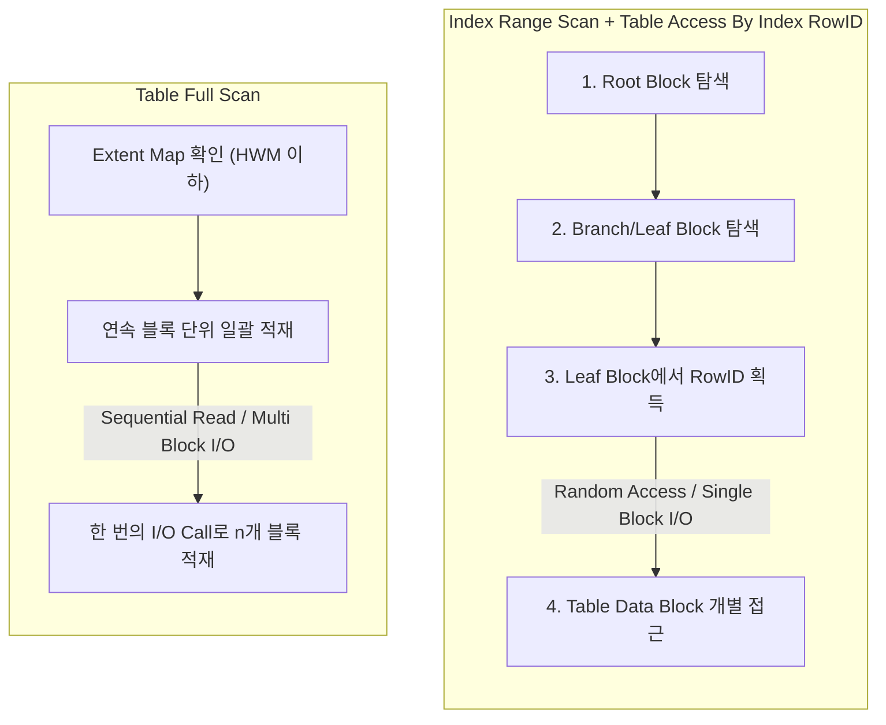
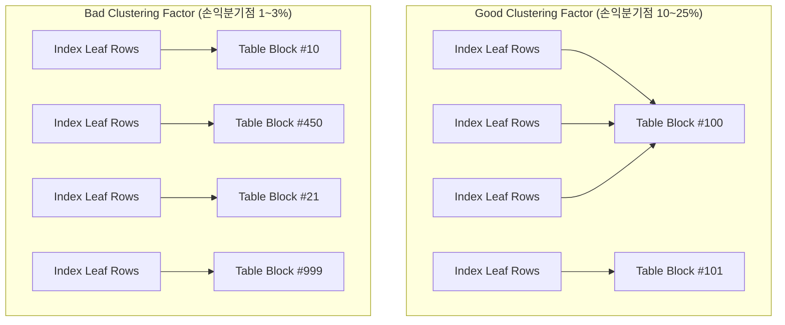
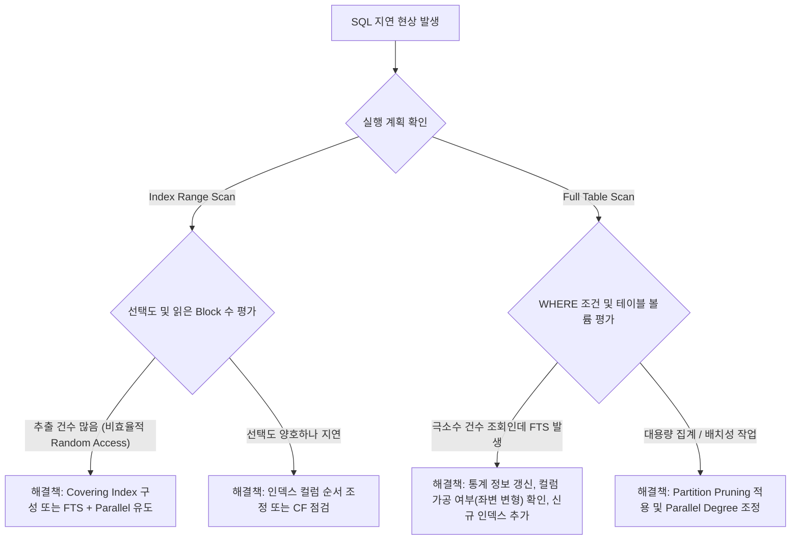

# 인덱스 스캔 vs 풀 테이블 스캔 (Index Scan vs Full Table Scan)

> "인덱스를 타면 무조건 빠르고, Full Table Scan은 튜닝 대상이다?"  
> 이는 데이터베이스 성능 튜닝에서 가장 흔하게 발생하는 오해 중 하나입니다.

대용량 데이터를 처리하는 환경에서는 부적절한 인덱스 스캔이 오히려 시스템 전체의 I/O 병목을 유발하고, 풀 테이블 스캔(Full Table Scan, 이하 FTS)이 수십 배 이상 빠른 성능을 내는 경우가 빈번합니다. 

두 방식의 물리적 I/O 메커니즘, 손익분기점(Break-even point), 그리고 실무 최적화 전략을 심층적으로 살펴봅니다.

---

## 1. I/O 메커니즘 관점의 본질적 차이

두 방식의 차이를 결정짓는 핵심은 **"데이터를 디스크에서 어떤 방식으로 읽어오는가"**와 **"버퍼 캐시를 어떻게 활용하는가"**입니다.



### 1.1. Single Block I/O vs Multi Block I/O

| 구분 | Index Scan (기본) | Full Table Scan (FTS) |
| :--- | :--- | :--- |
| **I/O 방식** | **Single Block I/O** (Random Access) | **Multi Block I/O** (Sequential Read) |
| **I/O 단위** | 1개 Block (8KB 등) | `DB_FILE_MULTIBLOCK_READ_COUNT` 개 블록 |
| **주요 대기 이벤트** | `db file sequential read` | `db file scattered read` / `direct path read` |
| **주요 비용 요소** | ROWID를 통한 테이블 블록 랜덤 액세스 부하 | 전체 블록을 순회하는 CPU/디스크 총 처리량 |
| **캐싱 특성** | 버퍼 캐시 일반 LRU 관리 (MRU 위치 배치) | LRU End 배치 (Cache Thrashing 방지) or Direct Path |

#### Single Block I/O
인덱스를 경유할 때는 탐색 트리(Root $\rightarrow$ Branch $\rightarrow$ Leaf)를 거쳐 대상 ROWID를 찾은 뒤, **테이블 블록을 한 번에 하나씩 개별 방문(Random Access)**합니다. 이로 인해 OS/스토리지 레벨에서 `db file sequential read` 대기 이벤트가 발생합니다. 읽어야 할 데이터가 수만 건으로 늘어나면 수만 번의 Single Block I/O Call이 발생해 응답 시간이 급격히 악화됩니다.

#### Multi Block I/O
반면 FTS는 테이블의 High Water Mark(HWM) 이하의 모든 블록을 **연속된 익스텐트(Extent) 단위로 한 번에 묶어서(Multi Block)** 읽습니다. 
한 번의 I/O Call로 수십 개(예: 64개, 128개)의 블록을 읽어들이기 때문에 블록당 읽기 비용이 Single Block I/O에 비해 극도로 낮습니다.

```sql
-- 오라클 Multi Block Read 설정 확인 예시
SHOW PARAMETER db_file_multiblock_read_count;
```

---

## 2. 버퍼 캐시와 Direct Path Read

### 2.1. 버퍼 캐시 오염(Cache Thrashing) 방지
과거 대용량 FTS는 Data Buffer Cache에 대량 블록을 밀어 넣어 다른 온라인 트랜잭션의 캐시된 블록들을 밀어내는(Cache Thrashing) 문제를 야기했습니다. 

오라클은 이를 방지하기 위해:
1. **LRU List의 끝단(LRU End)**에 적재하여 다음 I/O 시 즉시 재사용(Aging Out)되도록 하거나,
2. **Direct Path Read**를 통해 SGA의 버퍼 캐시를 완전히 우회하여 세션의 PGA로 직접 블록을 적재합니다.

> **Direct Path Read 발생 조건:**  
> Oracle 11g 이후 대용량 FTS 발생 시, 테이블 크기가 버퍼 캐시의 일정 비율(통상 버퍼 캐시 크기의 2~5배 초과)을 넘어서면 옵티마이저/엔진은 자동으로 SGA 버퍼 캐시를 거치지 않고 디스크에서 PGA로 직접 데이터를 읽어들입니다. 이 때 발생하는 대기 이벤트가 `direct path read`입니다.

---

## 3. 손익분기점(Break-Even Point)과 클러스터링 팩터

인덱스 스캔과 풀 스캔 중 어느 것이 유리한지를 결정하는 기준점을 **손익분기점(Break-Even Point)**이라고 부릅니다. 

통상 전체 데이터의 **2% ~ 15%** 수준으로 알려져 있으나, 이 수치는 고정된 값이 아니며 **클러스터링 팩터(Clustering Factor, CF)**에 의해 드라마틱하게 변합니다.

### 3.1. 클러스터링 팩터(Clustering Factor)란?
- 특정 인덱스 정렬 순서와 테이블 블록에 물리적으로 저장된 행들의 순서가 얼마나 일치하는가를 나타내는 지표입니다.
- 인덱스 리프 블록을 순회하면서 테이블 블록 번호가 변경될 때마다 카운트를 1씩 증가시켜 측정합니다.
  - **Best Case (CF $\approx$ 테이블 블록 수)**: 인덱스 순서와 물리적 저장 순서가 일치함. 인덱스를 통해 테이블을 읽을 때 같은 블록에 있는 데이터들을 연속해서 읽으므로 I/O가 최소화됨.
  - **Worst Case (CF $\approx$ 총 레코드 수)**: 인덱스 순서와 물리적 저장 순서가 무작위임. 한 건 읽을 때마다 매번 다른 데이터 블록을 I/O 해야 함.



### 3.2. 클러스터링 팩터에 따른 선택 가이드
- **CF가 양호한 경우:** 추출 건수가 전체의 15%~20%에 달하더라도 Index Range Scan이 FTS보다 더 효율적일 수 있습니다. (캐시 적중률 증가, 물리적 블록 I/O 수 감소)
- **CF가 불량한 경우:** 단 1~2%의 데이터만 조회하더라도 테이블 전체 블록 수보다 더 많은 Single Block I/O가 발생하여 심각한 쿼리 지연을 초래합니다. 이 경우 FTS가 훨씬 빠릅니다.

---

## 4. 인덱스 스캔의 세부 분류 및 특징

인덱스를 활용하는 방식에도 여러 가지가 있으며, 상황에 따라 Multi Block I/O를 사용하는 예외적 인덱스 스캔도 존재합니다.

### 4.1. 주요 인덱스 스캔 방식 비교

| 스캔 방식 | 특성 | I/O 방식 | 주요 사용 조건 |
| :--- | :--- | :--- | :--- |
| **Index Unique Scan** | 유일성(PK, Unique) 보장 컬럼 `=` 조건 | Single Block I/O | 단 1건의 rowid만 추출할 때 |
| **Index Range Scan** | 선두 컬럼 조건 범위 탐색 | Single Block I/O | 정렬된 리프 블록을 수평 탐색 |
| **Index Full Scan** | 인덱스 전체 리프 블록 순회 | Single Block I/O | 인덱스 선두 컬럼 조건은 없으나 ORDER BY 절을 대체하거나 필터링 조건이 있을 때 |
| **Index Fast Full Scan** | 세그먼트 전체를 익스텐트 단위 스캔 | **Multi Block I/O** | 쿼리에 필요한 모든 컬럼이 인덱스에 포함(Covering)되어 있고 순서 유지가 불필요할 때 |
| **Index Skip Scan** | 인덱스 선두 컬럼의 카디널리티가 낮을 때 중간 건너뛰기 | Single Block I/O | 선두 컬럼 조건이 누락되었으나 후행 컬럼 조건이 명확할 때 |

> **TIP: Index Fast Full Scan (`INDEX_FFS`)의 위력**  
> 테이블에 접근하지 않고 인덱스 세그먼트 자체를 Multi Block I/O로 고속 스캔합니다. 인덱스 트리의 정렬 순서는 무시되지만, 테이블 풀스캔보다 크기가 훨씬 작은 인덱스만을 대상으로 FTS처럼 동작하므로 집계(`COUNT`, `SUM`) 쿼리에서 최상의 효율을 보여줍니다.

---

## 5. 실무 성능 튜닝 판단 흐름 (Decision Flow)

실제 현업에서 성능 문제를 분석할 때 다음과 같은 순서로 스캔 방식을 재설계합니다.



### 5.1. 실무 튜닝 핵심 패턴

#### 사례 1: 대량 데이터 배치 집계 시 인덱스 스캔 제거
- **상황:** 수천만 건 테이블에서 최근 1개월 거래(약 150만 건, 전체의 8%)를 읽어 일별 합계를 집계하는 배치 쿼리.
- **원인:** 인덱스를 타면서 수십만 번의 `db file sequential read` 발생, 40분 이상 소요.
- **개선:** `/*+ FULL(t) PARALLEL(t 4) */` 힌트를 통해 FTS 및 병렬 쿼리로 유도. Multi Block I/O와 Direct Path Read가 적용되어 1분 20초 만에 완료.

#### 사례 2: 커버링 인덱스를 통한 Table Random Access 제거
- **상황:** 온라인 조회 쿼리에서 1만 건의 주문을 읽어 화면에 표시하는데 지연 발생.
- **원인:** 인덱스로 1만 건을 필터링한 후 테이블 블록을 1만 번 방문(Random Access).
- **개선:** `SELECT` 절에 필요한 잔여 컬럼을 인덱스 후행에 결합 인덱스로 추가. 테이블 블록 방문을 0건으로 만들어 응답 시간을 1.5초에서 0.05초로 단축.

---

## 6. 핵심 요약 및 체크리스트

1. **소량 데이터(OLTP)는 Index Scan, 대량 데이터(배치/OLAP)는 Full Table Scan**이 기본 원칙입니다.
2. **Single Block I/O**는 Random Access 비용이 크므로, 추출 건수가 많아질수록 기하급수적으로 비효율적입니다.
3. **Multi Block I/O**는 연속된 블록을 한 번에 읽어오므로 대용량 데이터 추출 시 압도적인 Throughput을 보장합니다.
4. 옵티마이저가 잘못된 스캔 방식을 선택할 때는 가장 먼저 **테이블 및 인덱스 통계 정보의 최신성**과 **클러스터링 팩터**를 점검해야 합니다.
