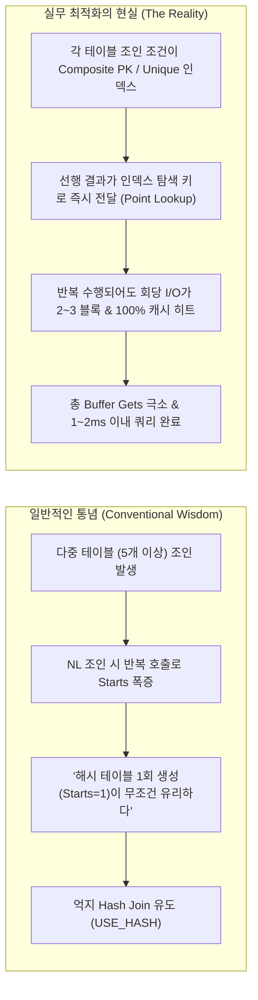
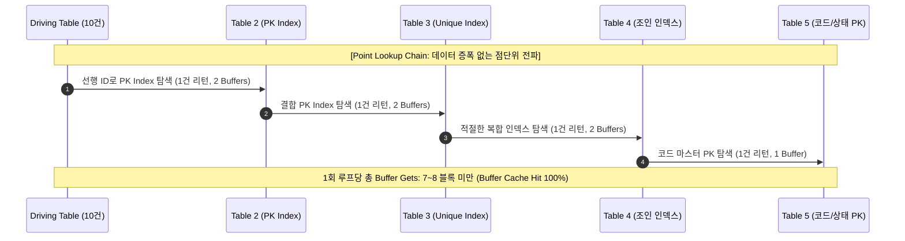
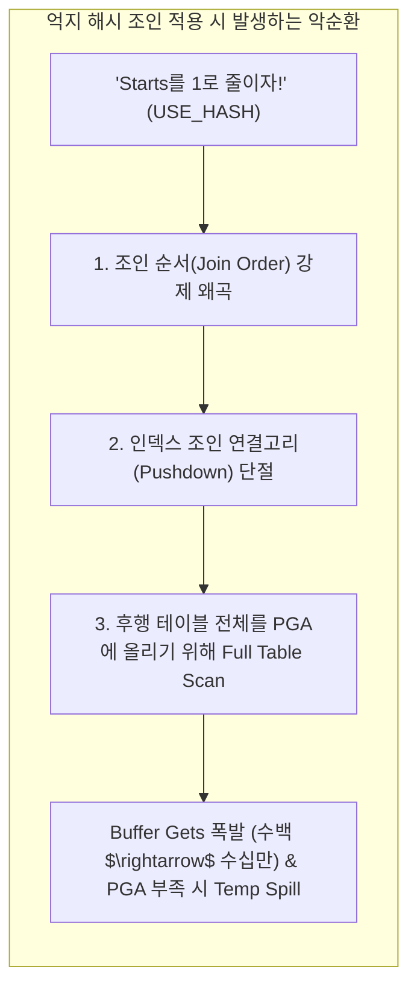

# 다중 테이블 조인(5개 이상)에서 NL 조인이 Hash Join을 압도하는 역설

> **"테이블이 5개 이상 엮이는 복잡한 대용량 조인에서는 무조건 해시 조인(Hash Join)이 유리하다?"**  
> 튜닝 현장에서 가장 널리 퍼져 있는 대표적인 고정관념이자 통념입니다.

일반적으로 테이블 개수가 늘어날수록 Nested Loop(NL) 조인은 Inner 테이블을 반복 조회(Starts 증가)하므로 심각한 Random Access I/O 병목을 유발할 것이라 여겨집니다. 그래서 많은 엔지니어들이 `Starts = 1`을 만들기 위해 억지로 `USE_HASH` 힌트를 주거나 해시 조인으로 유도하곤 합니다.

하지만 실무 최적화 과정에서는 **5개 이상의 테이블이 조인됨에도 불구하고 NL 조인이 Hash 조인보다 훨씬 적은 I/O(Buffer Gets)와 빠른 응답속도를 기록하며 압승하는 현상**이 빈번하게 관찰됩니다.

어째서 이런 역설이 발생하는지, 그 물리적 I/O 메커니즘과 옵티마이저의 동작 원리를 정리합니다.

---

## 1. 통념 vs 실무 현실: 무엇이 오해를 낳는가?



### 1.1. 해시 조인 만능론의 배경
해시 조인은 작은 집합(Build Input)을 읽어 PGA(Program Global Area)의 Hash Area에 인메모리 해시 테이블을 구축한 뒤, 큰 집합(Probe Input)을 스캔하면서 해시 함수를 통해 매칭합니다.
- **Starts = 1**: 빌드와 프로브가 각각 단 1회씩만 실행되므로, 루프를 돌며 반복 액세스하는 부하가 없습니다.
- 테이블이 5~6개 이상 연결되면 NL 조인의 경우 단계마다 `Starts`가 배수로 누적되므로, 통념상 해시 조인이 일괄 처리(Set-based) 관점에서 훨씬 효율적이라고 생각하기 쉽습니다.

### 1.2. 간과하기 쉬운 맹점
하지만 해시 조인이 성공하기 위한 전제 조건은 **"해시 테이블을 만들기 위해 읽어 들이는 각 집합의 스캔 비용이 크지 않아야 한다"**는 점입니다.

선행 집합의 결과로 후행 집합의 범위를 핀포인트로 좁힐 수 있는 환경에서 억지로 해시 조인을 걸어버리면, 오히려 **독립적으로 거대한 테이블들을 Full Scan/Index Full Scan하게 되면서 Buffer Gets가 기하급수적으로 폭증**합니다.

---

## 2. NL 조인이 압승하는 핵심 메커니즘 2가지

5개 이상의 다중 조인에서 NL 조인이 최상의 성능을 내는 환경은 명확한 공통점을 가집니다.



### 2.1. 조건 A: 점단위 조회(Point Lookup)와 훌륭한 조인 조건
조인되는 테이블들이 다음과 같은 물리적 특성을 가질 때입니다:
1. **완벽한 조인 컬럼 인덱스**: 조인 조건 컬럼이 PK 또는 카디널리티가 1에 가까운 복합 인덱스로 구성되어 있음.
2. **데이터 증폭(Explosion)의 부재**: 선행 테이블에서 후행 테이블로 넘어갈 때 1:1 관계이거나, 극소수(1~2건)만 반환되어 조인 단계를 거듭해도 모수(Rows)가 불어나지 않음.
3. **Access Predicate 전달**: 선행 테이블에서 읽은 특정 컬럼 값이 후행 테이블 인덱스의 탐색 시작/종료점(Access Key)으로 즉시 바인딩되어 동작함.

### 2.2. 조건 B: Starts가 증가해도 Buffer Gets 누적이 미미한 환경
옵티마이저 실행계획 상에서 `Starts`가 100회, 1,000회 찍히는 것을 보고 지레 겁을 먹는 경우가 많습니다. 하지만 산수를 해보면 본질이 보입니다:

> **Total Buffer Gets = Starts × Buffers Per Execution (1회당 방문 블록 수)**

- 만약 1회 실행당 읽는 블록 수(`Buffers / Starts`)가 **2~3 블록**(Root → Branch → Leaf → Table) 수준이라면?
- **100 Starts × 2 Buffers = 200 Buffers**
- 게다가 해당 블록들은 데이터 버퍼 캐시(CBC Latch) 상에 계속 머물러(Hot Block) 있으므로 물리 I/O(Disk Read)가 전혀 발생하지 않고 메모리 상에서 수 마이크로초 단위로 즉시 반환됩니다.
- 즉, **Starts의 숫자 자체가 중요한 것이 아니라, 단계별 Buffer Gets가 통제되고 있는가**가 핵심입니다.

---

## 3. 억지 해시 조인(Forced Hash Join)이 부르는 3대 재앙

Starts를 줄이겠다고 억지로 `USE_HASH` 힌트를 적용하거나 해시 조인을 강제했을 때, 시스템 내부에서는 치명적인 성능 저하가 일어납니다.



### 3.1. 재앙 1: 조인 순서(Join Order)의 강제 왜곡
해시 조인은 두 집합 중 작은 쪽을 Build Input(해시 테이블 생성), 큰 쪽을 Probe Input으로 삼아야 합니다. 테이블이 5개 이상 엮인 상태에서 억지로 해시 조인을 유도하면, 옵티마이저는 해시 테이블 빌드에 유리한 순서로 조인 트리를 재구성하게 됩니다. 이 과정에서 **가장 최적으로 데이터를 줄여주던 드라이빙-드리븐 관계가 뒤흔들려 엉뚱한 테이블부터 읽기 시작**합니다.

### 3.2. 재앙 2: 인덱스 조인 연결고리의 단절 (Key Access $\rightarrow$ Independent Full Scan)
이것이 가장 결정적인 차이입니다.
- **NL 조인**: 선행 테이블에서 찾아낸 `ORDER_ID = 10023`을 들고 후행 `ORDER_DETAIL` 테이블의 인덱스에 상수처럼 직접 접근(`ACCESS("B"."ORDER_ID"=10023)`)합니다. 단 1~2개 블록만 읽고 끝납니다.
- **Hash 조인**: 두 집합이 서로 독립적으로 읽혀야 합니다. 즉, 선행 테이블에서 어떤 값이 나올지 모르는 상태에서 `ORDER_DETAIL` 테이블을 통째로 읽어 PGA에 해시 테이블을 만들어야 합니다.
  결과적으로 인덱스를 이용한 정교한 핀포인트 조회가 불가능해지고, **테이블 전체를 Full Table Scan하거나 수백만 건의 Index Full Scan을 수행**하게 됩니다.

### 3.3. 재앙 3: Buffer Gets 폭증 및 PGA 메모리 오버헤드
- Starts는 분명 1로 줄었습니다.
- 하지만 수백 건만 점단위로 읽고 끝낼 수 있었던 것을 수십만~수백만 건의 테이블 전체 블록을 버퍼 캐시로 퍼올리면서 **Buffer Gets가 수백 개에서 수십만~수백만 개로 급증**합니다.
- 해시 테이블 크기가 프로세스별 `pga_aggregate_target` 또는 작업 공간(`_pga_max_size`)을 초과하면 **1-Pass / Multi-Pass Hash Join**으로 전환되면서 Temp 테이블스페이스에 데이터를 쓰고 다시 읽는 디스크 I/O(`direct path write/read temp`)가 발생해 쿼리가 수 분 이상 멈춰 서게 됩니다.

---

## 4. 실행계획 비교 분석: A-Plan으로 검증하기

테이블 5개(`ORDERS`, `ORDER_DETAIL`, `ITEM`, `MEMBER`, `DELIVERY`)를 조인하는 동일한 쿼리를 각각 NL 조인과 Hash 조인으로 수행했을 때의 실측 실행계획(`DBMS_XPLAN.DISPLAY_CURSOR`, `ALLSTATS LAST`) 차이입니다.

### 4.1. 최적의 NL 조인 실행계획 (Point Lookup 유지)

```sql
----------------------------------------------------------------------------------------------------------------------------------
| Id  | Operation                                  | Name              | Starts | E-Rows | A-Rows |   A-Time   | Buffers | Reads  |
----------------------------------------------------------------------------------------------------------------------------------
|   0 | SELECT STATEMENT                           |                   |      1 |        |     10 |00:00:00.01 |     112 |      0 |
|   1 |  NESTED LOOPS                              |                   |      1 |     10 |     10 |00:00:00.01 |     112 |      0 |
|   2 |   NESTED LOOPS                             |                   |      1 |     10 |     10 |00:00:00.01 |      82 |      0 |
|   3 |    NESTED LOOPS                            |                   |      1 |     10 |     10 |00:00:00.01 |      52 |      0 |
|   4 |     NESTED LOOPS                           |                   |      1 |     10 |     10 |00:00:00.01 |      22 |      0 |
|*  5 |      TABLE ACCESS BY INDEX ROWID BATCHED   | ORDERS            |      1 |     10 |     10 |00:00:00.01 |       4 |      0 |
|*  6 |       INDEX RANGE SCAN                     | ORDERS_IDX01      |      1 |     10 |     10 |00:00:00.01 |       2 |      0 |
|   7 |      TABLE ACCESS BY INDEX ROWID           | ORDER_DETAIL      |     10 |      1 |     10 |00:00:00.01 |      18 |      0 |
|*  8 |       INDEX UNIQUE SCAN                    | ORDER_DETAIL_PK   |     10 |      1 |     10 |00:00:00.01 |      10 |      0 |
|   9 |     TABLE ACCESS BY INDEX ROWID             | ITEM              |     10 |      1 |     10 |00:00:00.01 |      30 |      0 |
|* 10 |      INDEX UNIQUE SCAN                     | ITEM_PK           |     10 |      1 |     10 |00:00:00.01 |      20 |      0 |
|  11 |    TABLE ACCESS BY INDEX ROWID              | MEMBER            |     10 |      1 |     10 |00:00:00.01 |      30 |      0 |
|* 12 |     INDEX UNIQUE SCAN                      | MEMBER_PK         |     10 |      1 |     10 |00:00:00.01 |      20 |      0 |
|  13 |   TABLE ACCESS BY INDEX ROWID               | DELIVERY          |     10 |      1 |     10 |00:00:00.01 |      30 |      0 |
|* 14 |    INDEX UNIQUE SCAN                       | DELIVERY_PK       |     10 |      1 |     10 |00:00:00.01 |      20 |      0 |
----------------------------------------------------------------------------------------------------------------------------------
```

> **분석:**
> - 각 단계별 `Starts`는 10회씩 발생하지만, `INDEX UNIQUE SCAN`을 통해 회당 2~3 블록의 버퍼만 접근합니다.
> - 5개 테이블이 조인되었음에도 불구하고 전체 쿼리가 읽은 **Buffers는 고작 112 블록**, 수행 시간은 **0.01초 미만**입니다.

---

### 4.2. Starts 줄이려다 참사가 난 Hash 조인 실행계획

```sql
------------------------------------------------------------------------------------------------------------------------------------------------
| Id  | Operation                    | Name         | Starts | E-Rows | A-Rows |   A-Time   | Buffers | Reads  |  OMem |  1Mem | Used-Mem|
------------------------------------------------------------------------------------------------------------------------------------------------
|   0 | SELECT STATEMENT             |              |      1 |        |     10 |00:00:04.28 |  384520 | 124000 |       |       |         |
|*  1 |  HASH JOIN                   |              |      1 |     10 |     10 |00:00:04.28 |  384520 | 124000 |  18M  | 2048K | 17M (0) |
|   2 |   TABLE ACCESS FULL          | DELIVERY     |      1 |   800K |   800K |00:00:00.62 |   42100 |  38000 |       |       |         |
|*  3 |   HASH JOIN                  |              |      1 |     10 |     10 |00:00:03.55 |  342420 |  86000 |  25M  | 3120K | 24M (0) |
|   4 |    TABLE ACCESS FULL         | MEMBER       |      1 |   1.2M |   1.2M |00:00:00.95 |   78500 |  71000 |       |       |         |
|*  5 |    HASH JOIN                 |              |      1 |     10 |     10 |00:00:02.48 |  263920 |  15000 |  32M  | 4096K | 30M (0) |
|   6 |     TABLE ACCESS FULL        | ITEM         |      1 |   500K |   500K |00:00:00.41 |   31200 |  12000 |       |       |         |
|*  7 |     HASH JOIN                |              |      1 |     10 |     10 |00:00:01.98 |  232720 |   3000 |  12M  | 1850K | 11M (0) |
|*  8 |      TABLE ACCESS FULL       | ORDER_DETAIL |      1 |   3.5M |   3.5M |00:00:01.82 |  232716 |   3000 |       |       |         |
|*  9 |      TABLE ACCESS BY INDEX   | ORDERS       |      1 |     10 |     10 |00:00:00.01 |       4 |      0 |       |       |         |
|* 10 |       INDEX RANGE SCAN       | ORDERS_IDX01 |      1 |     10 |     10 |00:00:00.01 |       2 |      0 |       |       |         |
------------------------------------------------------------------------------------------------------------------------------------------------
```

> **비극의 결과:**
> - 소원대로 모든 오퍼레이션의 `Starts`는 1로 줄었습니다.
> - 하지만 `DELIVERY`, `MEMBER`, `ITEM`, `ORDER_DETAIL`의 모든 데이터를 해시 테이블에 담기 위해 **Full Table Scan이 연쇄적으로 발생**했습니다.
> - **Buffers: 112 $\rightarrow$ 384,520 (약 3,400배 폭증!)**
> - **수행 시간: 0.01초 $\rightarrow$ 4.28초 (400배 이상 지연!)**
> - 대량의 Multi Block I/O로 디스크 대기(`db file scattered read`)가 발생하고 PGA 메모리 점유 및 버퍼 캐시 밀림(Cache Thrashing) 현상까지 야기했습니다.

---

## 5. 핵심 비교 요약표

| 비교 항목 | 적절한 인덱스를 기반으로 한 NL 조인 | 억지로 유도된 Hash 조인 |
| :--- | :--- | :--- |
| **조인 방식** | 선행 로우별 건건이 인덱스 탐색 (Loop) | 각 테이블 독립 스캔 후 인메모리 해시 매칭 |
| **Starts 횟수** | 선행 결과 건수만큼 배수로 증가 (N회) | 무조건 1회 (1회) |
| **회당 I/O 비용** | **극소 (2~3 블록)** | **극대 (테이블 전체 블록)** |
| **총 Buffer Gets** | Starts × (2~3) → **수백 블록 수준** | 테이블 전체 블록 합산 → **수십만~수백만 블록** |
| **메모리 사용** | Data Buffer Cache (기존 캐시 활용) | PGA Workarea (대규모 Hash Table 빌드 필요) |
| **데이터 증폭 여부** | 1:1 또는 1:0 유지로 증폭 없음 | 전체 집합을 퍼올려 메모리에 적재 |
| **주요 대기 이벤트** | 거의 없음 (캐시 히트) 또는 `db file sequential read` | `db file scattered read`, `direct path write/read temp` |
| **적합한 상황** | **드라이빙 집합이 작고, 각 테이블의 조인 조건이 인덱스를 완벽하게 만족할 때** | **드라이빙 집합이 크고, 대량 데이터 집합 간의 1:N / N:M 조인일 때** |

---

## 6. 실무 튜닝 체크리스트: Starts의 함정에 빠지지 않는 법

다중 테이블 조인 쿼리를 튜닝할 때 다음 원칙을 기억해야 합니다.

1. **`Starts` 수치에 겁먹지 마라**:
   - 실행계획을 볼 때 단순히 `Starts` 컬럼이 크다고 무조건 비효율인 것은 아닙니다.
   - 반드시 **`Buffers / Starts` (회당 블록 수)**와 **총 `Buffers`**를 먼저 계산해야 합니다. 회당 1~3 블록 내외로 억제되고 있다면 훌륭한 플랜입니다.

2. **조인 연결고리가 인덱스 Access로 풀리는지 확인하라**:
   - `Predicate Information`에서 후행 테이블의 인덱스 스캔 조건이 `access(...)`로 명확히 잡히고 있는지, 아니면 무의미한 `filter(...)`로 빠지는지 점검합니다.
   - 선행 결과가 후행의 키로 정확히 바인딩된다면 NL 조인의 체인이 가장 강력합니다.

3. **5개 테이블이 조인되어도 최종 결과가 소량이라면 NL이 최우선이다**:
   - OLTP 환경이나 화면 단건/목록 조회성 쿼리는 테이블이 5개, 10개가 엮여 있어도 최종 반환 건수는 수십 건 이내인 경우가 대부분입니다.
   - 이 경우 해시 조인은 불필요하게 모수를 전체 스캔하는 과도한 오버헤드(Overkill)가 됩니다.

4. **옵티마이저의 통계정보 왜곡을 주의하라**:
   - 다중 조인에서 옵티마이저가 뜬금없이 중간에 `HASH JOIN`을 선택하는 주된 이유는 **테이블 간 조인 카디널리티 계산 왜곡(Under-estimation 또는 Over-estimation)** 때문입니다.
   - 조인 조건 컬럼의 히스토그램이나 다중 컬럼 확장 통계(Extended Statistics)를 확인하고, 필요하다면 `LEADING`과 `USE_NL` 힌트로 올바른 핀포인트 탐색 순서를 고정해 주어야 합니다.

---

## 7. 결론

> **"Starts를 줄이려다 Buffers를 폭발시키지 마라."**

5개 이상의 테이블 조인이라 할지라도:
1. 시작 드라이빙 모수가 잘 통제되고,
2. 각 테이블별 조인 조건이 훌륭하여 적절한 인덱스를 기반으로 점단위 조회가 수행되며,
3. 반복 조회 시에도 Buffer Gets가 누적되어 커지지 않는다면,

**NL 조인은 Hash 조인이 결코 흉내 낼 수 없는 극강의 I/O 효율과 응답속도를 선사합니다.**  
무조건적인 `USE_HASH` 맹신을 버리고, I/O 메커니즘의 본질인 **Buffer Gets**를 기준으로 최적의 조인 방식을 결정해야 합니다.
