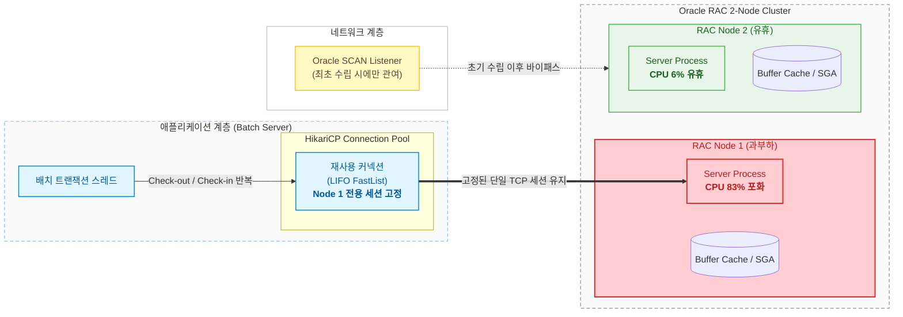
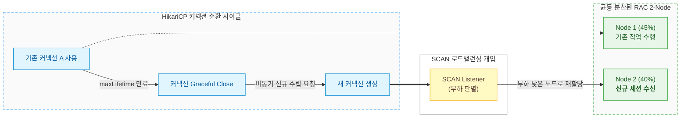

# Oracle RAC 환경의 HikariCP 노드 쏠림 진단: Connection Affinity 한계와 maxLifetime을 통한 부하 분산 전략

2개 이상의 인스턴스가 단일 스토리지를 공유하는 Oracle RAC(Real Application Clusters) 환경은 고가용성(HA)뿐만 아니라 다중 노드를 통한 작업 부하 분산(Load Balancing)을 핵심 목표로 삼는다.  
그러나 애플리케이션 계층에서 Java 진영의 표준 커넥션 풀인 HikariCP를 기본 설정으로 연동할 경우, 클러스터의 장점을 살리지 못하고 특정 단일 노드로만 트랜잭션이 쏠리는 병목이 자주 발생한다.

특히 복수의 Step에 걸쳐 대량의 SQL을 연속으로 호출하는 대규모 배치(Batch) 작업에서 이러한 현상이 두드러진다.  
본 글에서는 HikariCP 고유의 커넥션 관리 메커니즘으로 인해 발생하는 RAC 노드 편중 현상의 물리적 원인을 분석하고, `maxLifetime` 파라미터 조정을 통해 노드 간 부하 평준화를 달성한 프로덕션 엔지니어링 사례와 트레이드오프를 공유한다.

---

## 1. 문제 상황: 단일 노드 CPU 80% 경보와 유휴 노드의 공존

배치 애플리케이션이 동작하는 새벽 시간대, Oracle RAC Node 1의 CPU 점유율이 80%를 넘어서며 시스템 경보가 발생했다.

```
[ RAC 2-Node 실시간 CPU 점유율 대조 ]
- RAC Node 1 : CPU 83% (Alert 발생, Foreground 작업 적체)
- RAC Node 2 : CPU 6%  (Idle 상태, 유휴 자원 방치)
```

클러스터 전체 관점에서 가용 코어(Core) 자원의 절반이 완전히 놀고 있는 상태였다.  
이러한 상황에서 인프라 관점의 단순한 판단은 "배치 수행 중 DB CPU가 포화되었으니 DB 노드 사양을 스케일업(Scale-up)해야 한다"는 결론으로 흐르기 쉽다.

그러나 2개 노드로 구성된 RAC 환경에서 절반의 하드웨어 리소스가 방치된 채 특정 노드만 증설하는 조치는 근본적인 원인을 외면한 비효율적인 비용 낭비에 불과했다. 필요한 조치는 인프라 증설이 아니라, 애플리케이션 계층과 DB 클러스터 간의 **물리 커넥션 라우팅 메커니즘 정상화**였다.

---

## 2. 근본 원인 분석: SCAN 로드밸런싱과 HikariCP의 충돌

클러스터 레벨에서 로드밸런싱이 무력화되고 단일 노드에 부하가 집중된 이유는, Oracle RAC의 접속 메커니즘과 HikariCP의 내부 풀링 아키텍처가 상충했기 때문이다.


<p align="center"><em>Figure 1: HikariCP의 LIFO 재사용 특성으로 인한 Oracle RAC 단일 노드 쏠림 현상</em></p>

### 2.1. Oracle SCAN의 한계: '신규 연결 수립' 시점에만 개입
Oracle RAC는 클라이언트의 접속 요청을 분산하기 위해 SCAN(Single Client Access Name)과 Local Listener를 사용한다.  
- 클라이언트가 SCAN IP로 접속하면, SCAN Listener는 각 노드의 실시간 부하(Load Balance Advisory)를 확인한 뒤 가장 한가한 노드의 Local Listener로 접속을 리다이렉트한다.
- **핵심 메커니즘**: SCAN Listener는 **물리적인 TCP 커넥션이 최초로 생성(Handshake)되는 순간에만 개입**한다. 일단 소켓이 맺어지고 나면, 해당 커넥션 위에서 실행되는 모든 SQL 문장은 SCAN을 거치지 않고 해당 노드의 Dedicated Server Process와 직접 통신한다.

### 2.2. HikariCP의 LIFO 구조와 강한 Connection Affinity
HikariCP는 CPU 캐시 라인 적중률 극대화와 잠금 없는 동시성을 위해 `FastList` 기반의 LIFO(Last-In-First-Out) 스택 구조를 채택하고 있다.
1. **Warm Connection 우선 할당**:  
   방금 작업을 마치고 풀에 반납(Check-in)된 '따끈따끈한(Warm)' 커넥션이 다음 작업 세션에 최우선으로 다시 할당(Check-out)된다.
2. **소수 커넥션의 지속적인 재사용**:  
   배치 프로세스 내부에서 스레드가 순차적으로 SQL을 날릴 때, 풀 전체에 10개의 커넥션이 존재하더라도 실제로 작업을 수행하는 커넥션은 1~2개에 집중된다.
3. **노드 결합(Connection Affinity) 고착**:  
   애플리케이션 구동 시점에 Node 1로 연결된 소수의 물리 커넥션이 지속적으로 재사용되면서, 수만 건의 배치 INSERT/SELECT 문장이 오직 Node 1로만 전달된다.  
   결과적으로 Oracle SCAN의 로드밸런싱은 무력화되고, 특정 노드에 물리 세션이 묶여버리는 현상이 발생한다.

### 2.3. Oracle UCP 대비 범용 풀의 태생적 제약
Oracle 전용 커넥션 풀인 UCP(Universal Connection Pool)는 FCF(Fast Connection Failover) 및 ONS(Oracle Notification Service)와 긴밀히 연동되어, 런타임 트랜잭션 부하에 따라 세션을 동적으로 라우팅하는 RCLB(Runtime Connection Load Balancing) 기능을 제공한다.  
반면 HikariCP와 같은 오픈소스 범용 풀은 RAC의 런타임 인스턴스 메트릭을 알지 못하므로, 커넥션 풀 레벨에서 의도적인 순환 메커니즘을 설계하지 않으면 RAC 환경에서 노드 편중을 피하기 어렵다.

---

## 3. 해결 전략: maxLifetime 조정을 통한 주기적 커넥션 회전

물리 커넥션이 한 번 맺어진 채 반영구적으로 유지되는 것이 문제의 원인이라면, 커넥션의 생명주기를 의도적으로 단축시켜 **SCAN 로드밸런싱이 주기적으로 다시 개입하도록 유도**하는 것이 가장 확실한 해법이다.


<p align="center"><em>Figure 2: maxLifetime 단축을 통한 커넥션 주기적 교체 및 노드 로드밸런싱 복원</em></p>

### 3.1. 파라미터 튜닝: 30분에서 30초~1분으로의 단축
HikariCP의 `maxLifetime` 기본 권장값은 30분(`1,800,000ms`)이다. 일반적인 단일 DB 인스턴스 환경에서는 핸드셰이크 비용을 아끼기 위해 긴 수명을 유지하는 것이 일반적이다.  
그러나 다중 노드 분산이 필수적인 배치 환경에서는 이 값을 **30초(`30000ms`)에서 1분(`60000ms`)** 수준으로 대폭 단축했다.

```yaml
spring:
  datasource:
    hikari:
      pool-name: BatchHikariPool
      maximum-pool-size: 10
      minimum-idle: 5
      # RAC 노드 분산을 위해 커넥션 순환 주기 단축 (기본 30분 -> 1분)
      max-lifetime: 60000
      # 유휴 커넥션 정리 시간
      idle-timeout: 30000
      connection-timeout: 10000
```

- 커넥션이 60초에 도달하면 작업이 끝난 직후 풀에서 안전하게 닫히고 퇴역(Retire)한다.
- 빈자리를 채우기 위해 풀 백그라운드 스레드가 신규 물리 연결을 요청한다.
- 이때 SCAN Listener가 개입하여, 현재 부하가 현저히 낮은 RAC Node 2로 새로운 물리 연결을 맺어준다.
- 작업이 진행되면서 풀 내부의 활성 커넥션들이 Node 1과 Node 2로 자연스럽게 양분된다.

---

## 4. 실측 데이터와 프로덕션 검증

`maxLifetime`을 1분으로 설정한 후 대규모 배치 작업을 재수행하여 시스템 자원과 수행 시간을 정량적으로 측정했다.

### 4.1. 노드별 부하 평준화 및 소요 시간 비교

| 측정 지표 | 튜닝 전 (기본 maxLifetime 30분) | 튜닝 후 (maxLifetime 60초) | 개선 성과 |
| :--- | :--- | :--- | :--- |
| **RAC Node 1 CPU** | **83% (피크 임계치 초과)** | **45% (안정권)** | **피크 CPU 약 45% 감소** |
| **RAC Node 2 CPU** | **6% (유휴 방치)** | **40% (균등 분산)** | **양 노드 연산 자원 완전 활용** |
| **전체 클러스터 CPU 합계** | 약 89% | 약 85% | 불필요한 OS 경합 완화로 총 소모 감소 |
| **배치 총 소요 시간** | **9분 40초 (580초)** | **7분 15초 (435초)** | **수행 시간 25% 단축** |

단일 노드의 CPU가 80%를 넘어서면서 발생했던 프로세스 스케줄링 큐 적체가 해소되고, 2개 노드의 CPU 코어를 온전히 병렬로 활용하게 되면서 전체 배치 수행 시간이 **25% 단축**되었다.

---

## 5. 트레이드오프와 우려 사항 검증: 핸드셰이크와 Cache Fusion

커넥션을 주기적으로 끊고 다시 맺는 전략을 취할 때, 엔지니어링 관점에서 반드시 짚고 넘어가야 할 두 가지 잠재적 부작용이 있었다.


<p align="center"><em>Figure 3: 주기적 커넥션 회전 도입 시 트레이드오프(비용 vs 이득) 분석</em></p>

### 5.1. TCP Handshake 및 프로세스 생성 오버헤드는 유의미한가?
- **우려**: 물리 커넥션을 맺을 때 TCP 3-way Handshake와 Oracle Dedicated Server Process 생성, PGA 메모리 할당이 수반된다.
- **실측 검증**:
  - 배치 평균 총 수행 시간은 약 10분(600초)이다.
  - `maxLifetime`을 60초로 두었을 때, 단일 커넥션 기준으로 10분 동안 발생하는 신규 연결 수립 횟수는 **고작 6~7회**에 불과하다.
  - 풀 전체가 10개 커넥션이라 하더라도 10분 동안 클러스터 전체에서 발생한 신규 접속은 60~70회 안팎이다.
  - 초당 수백 회씩 커넥션을 맺고 끊는 Connection Churn 상태가 아니며, 유휴 시간에 백그라운드로 안전하게 교체되므로 CPU 오버헤드는 측정 불가능할 정도로 미미했다.

### 5.2. RAC Cache Fusion 경합(`gc buffer busy`)의 영향도
- **우려**: 양쪽 노드에서 동일 테이블이나 인덱스 블록을 동시에 수정할 경우, 노드 간 고속 사설망(Private Interconnect)을 통해 데이터 블록을 주고받는 Cache Fusion 동기화 비용과 `gc buffer busy acquire` 대기 이벤트가 증가할 수 있다.
- **실측 검증**:
  - AWR 리포트 분석 결과, 노드 분산 이후 실제로 `gc current block 2-way` 및 `gc buffer busy` 대기 횟수가 소폭 상승했다.
  - 그러나 현대 엔터프라이즈 RAC의 Interconnect는 100Gbps 고속 네트워크 기반이며, 블록 전송은 디스크가 아닌 **인메모리(In-Memory) 전송**으로 처리된다. 이 지연 시간은 수 마이크로초에서 1~2밀리초 수준이다.
  - 반면 단일 노드 CPU가 80%를 초과하여 발생했던 스레드 락 경합 및 OS 런큐(Run Queue) 지연 시간은 수십~수백 밀리초에 달했다.
  - 즉, **미세한 메모리 레벨의 Cache Fusion 비용을 지불하고, 거대한 물리 CPU 코어 연산 자원을 확보하는 전략적 선택**이 압도적인 성능 향상을 이끌어냈다.

---

## 6. 회고 및 운영 적용 시 주의점

Oracle RAC와 범용 커넥션 풀을 조합할 때 최적의 성능을 끌어내기 위한 엔지니어링 교훈은 다음과 같다.

1. **OLTP 풀과 배치 풀의 분리 (DataSource Separation)**:  
   초당 수만 TPS가 인입되는 온라인 웹 API(OLTP) 풀에는 `maxLifetime`을 30초~1분으로 극단적으로 낮추면 안 된다. 동시 사용자 수가 많은 서비스에서는 순간적인 연결 재생성 폭증으로 Listener 병목이 발생할 수 있다.  
   단기 대량 처리가 목적인 배치 애플리케이션에 한해 독립된 DataSource를 구성하고 짧은 `maxLifetime`을 부여해야 한다.
2. **Oracle RAC Service(서비스명) 분리 병행**:  
   단순 SCAN 분산에만 의존하지 않고, `srvctl add service`를 통해 배치 전용 RAC Service(`BATCH_SVC`)를 별도로 등록하여 기본 인스턴스 우선순위를 제어하는 아키텍처적 조치를 병행하면 더욱 안정적인 자원 격리가 가능하다.
3. **인프라 스케일업 전 아키텍처 점검**:  
   클러스터 환경에서 단일 노드 자원 포화가 관측될 때, 하드웨어 증설을 결정하기 전 노드 간 트래픽이 실제로 어떻게 흐르고 있는지(물리 세션 결합 여부)를 먼저 프로파일링해야 한다.
